# Agent 工具与依赖准入检查器：架构、交互与异常图谱

版本 0.2 · 2026-10-07 · 设计基线。配套 `PRD_Architecture_Interaction.md`、`Architecture_Workflow_Atlas.html` 和机器合同。

**产品承诺：对获准的具体任务，检查允许调用什么、实际返回是否满足验收规则，并留下有范围、有来源、有局限的可复核记录。** Agent 提议与解释，后端确定性组件决定权限和事实，区块链保存跨主体可验证的记录承诺。

本图谱包含 12 个视图与 57 种已识别异常。每项异常均有检测点、动作、状态、用户提示、恢复、证据、责任人与验收方法。它是有边界的风险模型，不声称穷尽所有攻击或故障；未知事件进入 SC-O08 / SC-E05，冻结受影响能力后复核。

**当前交付成熟度：** 图、PRD、合同、样例和离线交互设计已制作；后端、真实模型、真实数据、安全控制、数据库恢复、签名器及主网部署尚未通过实际联调。57 项场景均标记 `DESIGN_REQUIRED`，不能作为已通过的安全测试。原有 25 项验收计划与本目录重叠，不相加为 82 项。

## 1. 范围、用户与取舍

| 层级 | 目标 | 本次范围与边界 |
| --- | --- | --- |
| 首要用户 | 需要接入第三方工具的研究 Agent 开发者、平台工程师 | 为一次服务选择提供可解释、可复核的准入与验收 |
| 首要任务 | 查询 Ethereum 地址的原生 ETH 余额 | chainId=1；finalized 固定 Snapshot；精确 wei；只读 |
| 候选 | 管理员预登记的 HTTP RPC 或 MCP 服务 | 最多两个候选、两次候选调用、一次备用切换；默认拒绝任意 URL |
| Agent | 单个受限编排 Agent | 五个模型可见工具；不能签发凭据、改变策略、运行 shell 或签交易 |
| 安全 | 客户端依赖、能力、网络出口、任务验收、证据完整性 | 远程部署 SBOM 未绑定部署时只作声明；不保证发现所有漏洞与注入 |
| Blockchain | Ethereum 数据/身份职责；BOT 独立证据登记 | BOT chainId=677；Ethereum 身份适配尚未完成；两条链不得混写 |
| P1 | 更高价值只读服务的可复用验收模板 | 先证明客户效用，再增加历史数据、索引服务和证明验证 |
| 延后 | 自动安装依赖、stdio、任意网页抓取、交易写入、资金托管 | 需要独立威胁模型与权限设计，不能从当前只读合同直接扩展 |

原生余额适合验证闭环，但两个参考 RPC 已能回答该问题。这个例子不能单独证明商业必要性；必须验证复杂服务集成、人工核查或事故追溯的成本是否下降。市场领先和支付意愿仍是待验证假设。[S8–S9]

## 2. 必须维持的安全不变量

| ID | 不变量 | 主要落实位置 |
| --- | --- | --- |
| I01 | 用户批准 exact revision/specHash/nonce；变更使旧批准失效 | Control、任务事务、D05 |
| I02 | 模型输出只作建议，不生成权限与已验收事实 | 工具允许表、Gateway、Verifier |
| I03 | required 检查未知时不 ALLOW；optional 未知明确展示 | Policy、D04、D10 |
| I04 | 实际连接目标、方法、参数、Snapshot 与短期凭据一致 | Egress、内部签名凭据、D03–D04 |
| I05 | jti 单次消费、预算递增与 DISPATCH_COMMITTED 原子提交 | 数据库短事务、D04 |
| I06 | 新 dispatch 与结果提交均核对 stopEpoch、policyEpoch、leaseGeneration | Worker、Gateway、D06–D07 |
| I07 | 停止 ACK 必须已持久化；已提交的外部调用仍可能被远端处理 | Control；前端不可假显示“已撤回” |
| I08 | PublicReport 不含自身 hash、签名、交易状态或私密令牌 | Evidence、JCS、D08 |
| I09 | 公开登记批准只覆盖确定 reportHash；发送前持久化签名交易 | Publication、Signer、D09 |
| I10 | 历史 CONFIRMED、当前主链、撤销、期限、内容完整性分别核验 | AnchorObservation、VerifyResult |
| I11 | LIVE 不可取 SAMPLE 数据；空配置、缺页、异常不进入默认成功 | 所有适配器与发布门槛 |
| I12 | 新风险优先禁用受影响范围；模型和用户页面不能自行放宽 | Policy 管理权限、事件响应 |

策略在 Run 内固定；安全禁用增加 policyEpoch 后，旧 Run 隔离或停止收尾，恢复时新建任务并重新批准。这样不会偷偷修改旧报告的 policyHash。租约恢复则允许新工作器在同一固定策略下，接管已持久化且摘要正确的响应重新验收；记录接管事件和新代际，不能重发已消费的外部调用。

## 3. 图谱目录

图中灰色为外部或低信任输入，紫色为签名隔离，绿色为通过，黄色为待处理或未知，红色为拒绝。SVG/PNG 使用短英文节点便于工程对齐，中文 Mermaid 与节点表提供完整含义。每个视图只描述一种关系；它们共同构成工作链路，不把所有细节挤在一张总图中。

| 图 | 解决的问题 | 对应工程产物 |
| --- | --- | --- |
| D01 系统架构与信任边界 | 区分模型建议、后端权限、外部服务和签名权限；箭头表示受控接口，不代表模型可直连。 | 权限与模块接口 |
| D02 任务主流程与终态 | 主流程只描述一个已批准的只读任务；详细准入、停止和恢复分别见 D04、D06、D07。 | Task/Attempt 状态机 |
| D03 参考区块与数据验收 | 原生 eth_getBalance 返回数量，不返回状态证明；请求绑定、服务声明和证明必须分开。 | Snapshot 与 InvocationObservation |
| D04 准入与网络出口控制 | 检查结果必须决定后端能否连接和提交，不能只作为 UI 分数。 | 准入票据、出口策略、预算事务 |
| D05 用户界面与断线交互 | 这里的连接状态属于客户端视图，不能写入后端 TaskStatus 冒充真实任务终态。 | 页面状态、操作与反馈 |
| D06 停止竞争与晚到结果 | 竞争由数据库事务决定，不根据 UI 到达顺序猜测。 | 停止事务与提交守卫 |
| D07 工作器崩溃与持久恢复 | 恢复先检查已持久化的事实，再决定是否可执行下一步；不能靠重放整个 Agent 会话恢复权限。 | 持久恢复与 fencing |
| D08 证据链与公共核验 | 把内容、主体、链上位置、时效和任务事实分开，使失败位置可定位。 | 不可变报告与核验向量 |
| D09 链上登记与结果不明 | Publication 表示登记工作进度；AnchorObservation 表示后来某次对当前主链的核对。 | Publication 与 AnchorObservation |
| D10 数据采集与同步 | 大量数据的价值来自来源、版本和可复核性；缓存命中不能代替新鲜度规则。 | 数据来源、缓存和分页规则 |
| D11 构建部署与交付停点 | 同一产物进入测试与演示，使用明确的 LIVE、REPLAY、SAMPLE 标识。 | 发布、回滚和提交清单 |
| D12 创新假设与市场验证 | 原生余额查询是控制与验收试验，商业价值需在真实接入成本和失败损失中验证。 | 用户试点与市场假设 |

## D01. 系统架构与信任边界

区分模型建议、后端权限、外部服务和签名权限；箭头表示受控接口，不代表模型可直连。

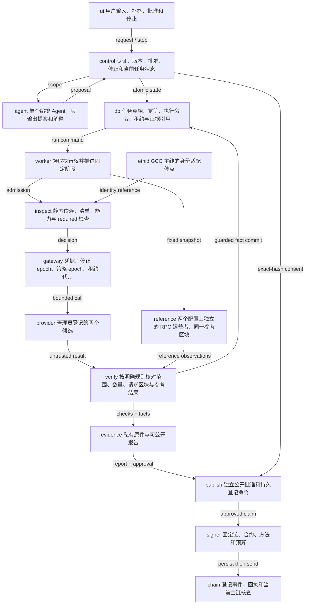

| 图内名称 | 中文含义 |
| --- | --- |
| User workspace | 用户输入、补答、批准和停止；没有工具密钥 |
| Control API | 认证、版本、批准、停止和当前任务状态 |
| Planner agent | 单个编排 Agent，只输出提案和解释 |
| Durable DB + outbox | 任务真相、幂等、执行命令、租约与证据引用 |
| Run worker | 领取执行权并推进固定阶段 |
| Inspection + policy | 静态依赖、清单、能力与 required 检查 |
| Execution gateway | 凭据、停止 epoch、策略 epoch、租约代际和预算 |
| Candidate services | 管理员登记的两个候选；返回内容仍不可信 |
| Reference resolver | 两个配置上独立的 RPC 运营者、同一参考区块 |
| Deterministic verifier | 按明确规则核对范围、数量、请求区块与参考结果 |
| Evidence builder | 私有原件与可公开报告；规范化与摘要 |
| Publication worker | 独立公开批准和持久登记命令 |
| Restricted signer | 固定链、合约、方法和预算；隔离密钥 |
| BOT registry | 登记事件、回执和当前主链核查 |
| Ethereum identity | GCC 主线的身份适配停点；当前未接入 |

- 模型不持有 gateway ticket、私钥、服务令牌；gateway_invoke 不是模型工具。
- 所有外部访问经过各自允许列表；参考源与候选源的独立性要有配置依据。
- Ethereum 数据链、Ethereum 身份位置与 BOT 登记链分别记录；图中的 Ethereum 身份节点是交付阻断项。

异常覆盖：SC-T06、SC-A01、SC-A04、SC-A07、SC-B11。详细处理与验收见 `review/Scenario_Coverage.md`。

## D02. 任务主流程与终态

主流程只描述一个已批准的只读任务；详细准入、停止和恢复分别见 D04、D06、D07。

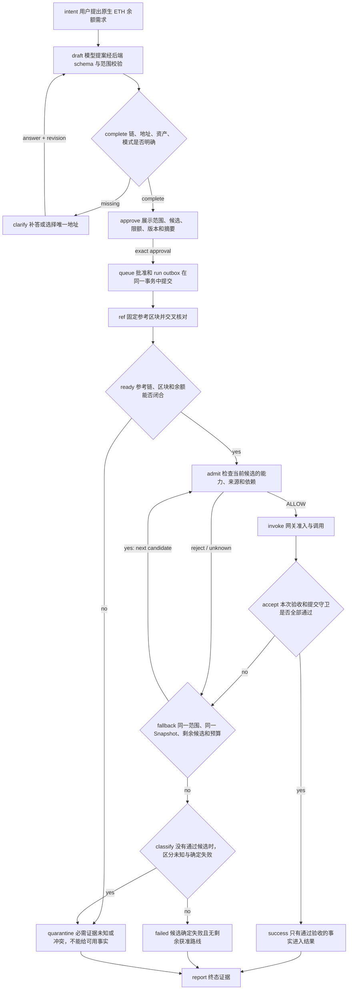

| 图内名称 | 中文含义 |
| --- | --- |
| User intent | 用户提出原生 ETH 余额需求 |
| Compile task scope | 模型提案经后端 schema 与范围校验 |
| Scope complete? | 链、地址、资产、模式是否明确 |
| NEEDS_INPUT | 补答或选择唯一地址 |
| AWAITING_APPROVAL | 展示范围、候选、限额、版本和摘要 |
| QUEUED | 批准和 run outbox 在同一事务中提交 |
| Resolve reference | 固定参考区块并交叉核对 |
| Reference agrees? | 参考链、区块和余额能否闭合 |
| Admission check | 检查当前候选的能力、来源和依赖 |
| Bounded invocation | 网关准入与调用 |
| Required checks PASS? | 本次验收和提交守卫是否全部通过 |
| Fallback still allowed? | 同一范围、同一 Snapshot、剩余候选和预算 |
| SUCCEEDED | 只有通过验收的事实进入结果 |
| Unknown evidence? | 没有通过候选时，区分未知与确定失败 |
| QUARANTINED | 必需证据未知或冲突，不能给可用事实 |
| FAILED | 候选确定失败且无剩余获准路线 |
| Immutable report | 终态证据；公开登记另行批准 |

- 未支持的资产、链或交易请求在生成可批准范围前返回 UNSUPPORTED_SCOPE。
- 切换不能增加预算、更改地址或改为 latest；参考冲突不能靠换候选绕过。
- 遇到确定性禁止规则立即停止该路线；已识别攻击不应由模型解释后放行。

异常覆盖：SC-T01、SC-T02、SC-A02、SC-A03、SC-A05、SC-N05、SC-N06、SC-O08。详细处理与验收见 `review/Scenario_Coverage.md`。

## D03. 参考区块与数据验收

原生 eth_getBalance 返回数量，不返回状态证明；请求绑定、服务声明和证明必须分开。

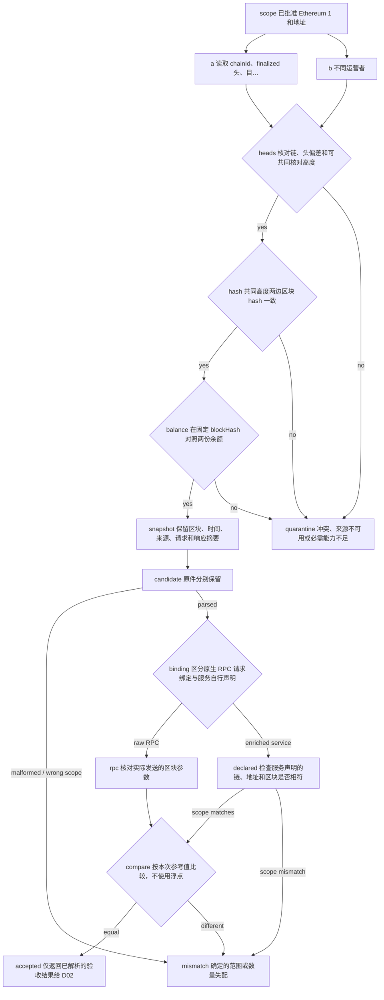

| 图内名称 | 中文含义 |
| --- | --- |
| Approved chain + address | 已批准 Ethereum 1 和地址 |
| Reference operator A | 读取 chainId、finalized 头、目标区块和余额 |
| Reference operator B | 不同运营者；不能仅以 URL 不同认定独立 |
| Compatible finalized heads? | 核对链、头偏差和可共同核对高度 |
| Same canonical block hash? | 共同高度两边区块 hash 一致 |
| Same reference balance? | 在固定 blockHash 对照两份余额 |
| Pin immutable Snapshot | 保留区块、时间、来源、请求和响应摘要 |
| Parse candidate response | 原件分别保留；校验 schema、范围和整数格式，失败不得进入验收 |
| Binding kind? | 区分原生 RPC 请求绑定与服务自行声明 |
| REQUEST_BOUND | 核对实际发送的区块参数；不能声称服务提供了证明 |
| PROVIDER_DECLARED | 检查服务声明的链、地址和区块是否相符 |
| Compare exact wei | 按本次参考值比较，不使用浮点 |
| Required data checks PASS | 仅返回已解析的验收结果给 D02；提交仍需 epochs 与租约守卫 |
| Verification FAIL | 确定的范围或数量失配；返回 D02 决定是否获准切换 |
| INCONCLUSIVE | 冲突、来源不可用或必需能力不足 |

- 原生 RPC 把旧值返回但恰与当前值相同，不能据此判断其内部使用了哪个区块；只记录可观察到的一致性。
- 服务明确声明错误区块时拒绝该声明，并跳过跨区块金额比较；参考 RPC 交叉核对不等于密码学状态证明。
- finalized 的区块时间早于当前时间是正常情况；不以单一墙钟阈值把 finalized 判为过期。

异常覆盖：SC-D01、SC-D02、SC-D03、SC-D04、SC-D05、SC-D06。详细处理与验收见 `review/Scenario_Coverage.md`。

## D04. 准入与网络出口控制

检查结果必须决定后端能否连接和提交，不能只作为 UI 分数。

```mermaid
flowchart TD
  subject["subject 固定命名空间、origin、transport、…"]
  egress["egress HTTPS、获准 origin、解析地址与重定向策略"]
  safe{"safe 连接目标是否仍在允许范围"}
  reject["reject 明确禁止或确定失配"]
  checks["checks 精确版本、完整公告页、声明来源类别"]
  required{"required 必需检查是否具备可用结果"}
  unknown["unknown 未知不是通过"]
  pass{"pass 所有必需规则通过"}
  ticket["ticket 绑定 spec、snapshot、policy、…"]
  guard["guard 核验签名、当前权限、过期、预算与单次 jti"]
  dispatch["dispatch 短事务登记消费、预算和逻辑调用开始"]
  call["call 无额外跟随重定向"]
  result["result 返回只作不可信数据"]
  subject --> egress
  egress --> safe
  safe -->|"no"| reject
  safe -->|"yes"| checks
  checks --> required
  required -->|"no"| unknown
  required -->|"yes"| pass
  pass -->|"no"| reject
  pass -->|"yes"| ticket
  ticket --> guard
  guard -->|"invalid / revoked"| reject
  guard -->|"current"| dispatch
  dispatch --> call
  call --> result
```

| 图内名称 | 中文含义 |
| --- | --- |
| Registered subject | 固定命名空间、origin、transport、manifestHash |
| Egress policy | HTTPS、获准 origin、解析地址与重定向策略 |
| Destination allowed? | 连接目标是否仍在允许范围 |
| REJECT | 明确禁止或确定失配；不得调用 |
| Capability + dependency checks | 精确版本、完整公告页、声明来源类别 |
| Required evidence resolved? | 必需检查是否具备可用结果 |
| QUARANTINE | 未知不是通过；可选未知单独展示 |
| Required checks PASS? | 所有必需规则通过；无覆盖性禁用 |
| Issue one-call ticket | 绑定 spec、snapshot、policy、manifest、caller、epochs 和代际 |
| Gateway guard | 核验签名、当前权限、过期、预算与单次 jti |
| Atomic consume + dispatch | 短事务登记消费、预算和逻辑调用开始 |
| Bounded provider call | 无额外跟随重定向；限制时长、字节与解析深度 |
| Store response then verify | 返回只作不可信数据；原件私有保存 |

- 公开环境拒绝内网、loopback、link-local 和云元数据目标；开发例外不能带入发布配置。
- DNS 校验应约束实际连接地址并保留 TLS 主机校验；只提前查 DNS 再由客户端重新解析仍有窗口。
- 不把用户 token 原样转给其他 audience；不自动安装包或启动上传的 stdio 配置。

异常覆盖：SC-T02、SC-T07、SC-T08、SC-A04、SC-A05、SC-N01、SC-N02、SC-N03、SC-N04、SC-N06、SC-D06、SC-D08、SC-D09、SC-O05、SC-O07。详细处理与验收见 `review/Scenario_Coverage.md`。

## D05. 用户界面与断线交互

这里的连接状态属于客户端视图，不能写入后端 TaskStatus 冒充真实任务终态。

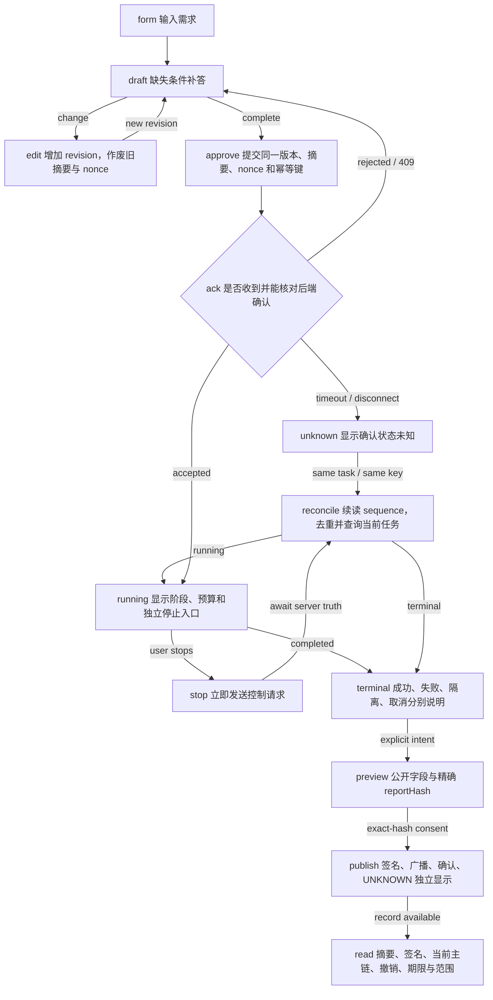

| 图内名称 | 中文含义 |
| --- | --- |
| Task input | 输入需求；只读范围说明 |
| Scope or clarification | 缺失条件补答；明确范围后展示批准卡 |
| Edit scope | 增加 revision，作废旧摘要与 nonce |
| Approve exact scope | 提交同一版本、摘要、nonce 和幂等键 |
| Acknowledgement known? | 是否收到并能核对后端确认 |
| ACK_UNKNOWN view | 显示确认状态未知；保留原 taskId 和键 |
| Query task + resume events | 续读 sequence，去重并查询当前任务 |
| Running workspace | 显示阶段、预算和独立停止入口 |
| Request stop | 立即发送控制请求；未 ACK 不显示已停止 |
| Terminal evidence | 成功、失败、隔离、取消分别说明 |
| Public field preview | 公开字段与精确 reportHash |
| Publication panel | 签名、广播、确认、UNKNOWN 独立显示 |
| Public verification | 摘要、签名、当前主链、撤销、期限与范围 |

- 普通请求忙碌、事件断开或模型慢均不能禁用独立停止操作；鉴权过期时明确停止尚未确认。
- 批准 ACK 丢失后查原任务；安全重试使用原幂等键。已发生的状态不能由页面返回或刷新撤回。
- 公开后原始地址等字段可能被第三方保存；确认前展示真正将公开的字段。

异常覆盖：SC-T01、SC-T03、SC-T04、SC-T05、SC-T06、SC-A03、SC-N07、SC-N08。详细处理与验收见 `review/Scenario_Coverage.md`。

## D06. 停止竞争与晚到结果

竞争由数据库事务决定，不根据 UI 到达顺序猜测。

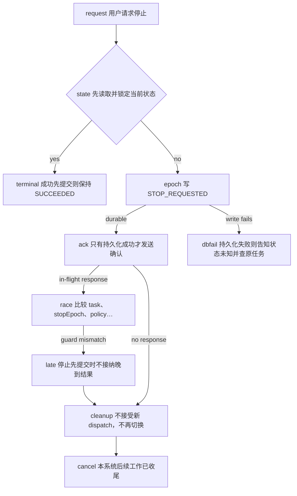

| 图内名称 | 中文含义 |
| --- | --- |
| Stop arrives | 用户请求停止 |
| Task already terminal? | 先读取并锁定当前状态 |
| Return terminal fact | 成功先提交则保持 SUCCEEDED |
| Commit stopEpoch + revoke | 写 STOP_REQUESTED；撤销未消费凭据 |
| ACK stop request | 只有持久化成功才发送确认 |
| Response commit guard | 比较 task、stopEpoch、policyEpoch、leaseGeneration |
| LATE_DISCARDED | 停止先提交时不接纳晚到结果 |
| Finish local work | 不接受新 dispatch，不再切换 |
| CANCELLED | 本系统后续工作已收尾 |
| Stop not acknowledged | 持久化失败则告知状态未知并查原任务 |

- 停止前已经 DISPATCH_COMMITTED 的请求可能继续发出或被远端处理；不承诺网络层撤回。
- 停止 ACK 后禁止新的逻辑 dispatch；外部晚到值不得生成成功结果或触发下一次调用。
- 终态报告不回写历史；后续发现产生独立事件或新报告版本。

异常覆盖：SC-N08、SC-O01、SC-O06。详细处理与验收见 `review/Scenario_Coverage.md`。

## D07. 工作器崩溃与持久恢复

恢复先检查已持久化的事实，再决定是否可执行下一步；不能靠重放整个 Agent 会话恢复权限。

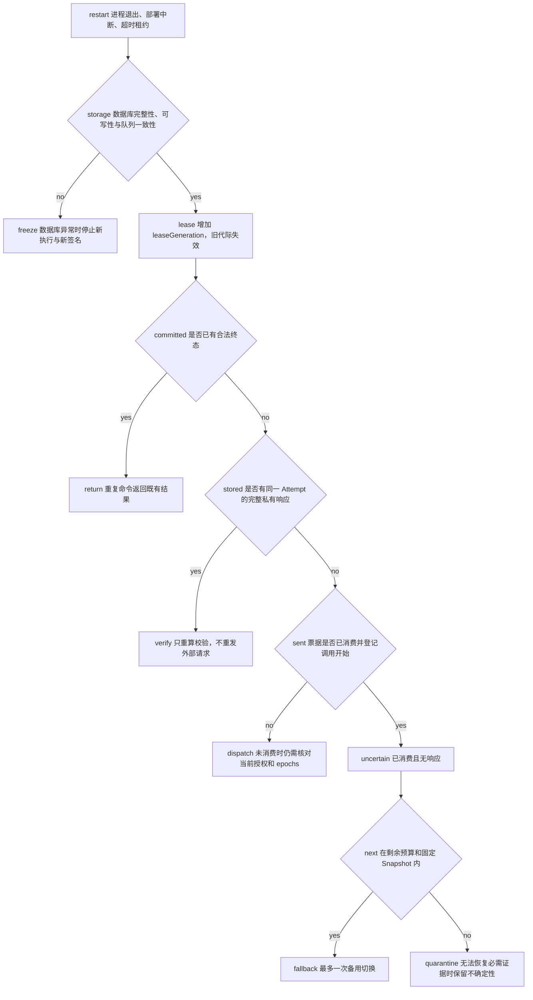

| 图内名称 | 中文含义 |
| --- | --- |
| Worker restart / lease expiry | 进程退出、部署中断、超时租约 |
| Storage healthy? | 数据库完整性、可写性与队列一致性 |
| Freeze new dispatch | 数据库异常时停止新执行与新签名 |
| Acquire new fenced lease | 增加 leaseGeneration，旧代际失效 |
| Fact already committed? | 是否已有合法终态 |
| Return durable outcome | 重复命令返回既有结果 |
| Response stored? | 是否有同一 Attempt 的完整私有响应 |
| Re-run deterministic verifier | 只重算校验，不重发外部请求 |
| Dispatch committed? | 票据是否已消费并登记调用开始 |
| Execute pending dispatch | 未消费时仍需核对当前授权和 epochs |
| External outcome unknown | 已消费且无响应；调用预算不退回 |
| Approved fallback available? | 在剩余预算和固定 Snapshot 内 |
| New candidate + new ticket | 最多一次备用切换 |
| QUARANTINED | 无法恢复必需证据时保留不确定性 |

- 旧工作器即使仍存活，也不能用旧 leaseGeneration 消费凭据或提交事实。
- JSON-RPC 的 request id 不是远端任务查询接口；没有服务查询能力时不能声称已查回原调用。
- 恢复演练必须覆盖提交前后崩溃、重复 outbox 和损坏存储；本图是设计要求，不是已恢复成功的证据。

异常覆盖：SC-T04、SC-T07、SC-N05、SC-O01、SC-O02、SC-O03、SC-O04、SC-O05、SC-O07、SC-O08、SC-E05。详细处理与验收见 `review/Scenario_Coverage.md`。

## D08. 证据链与公共核验

把内容、主体、链上位置、时效和任务事实分开，使失败位置可定位。

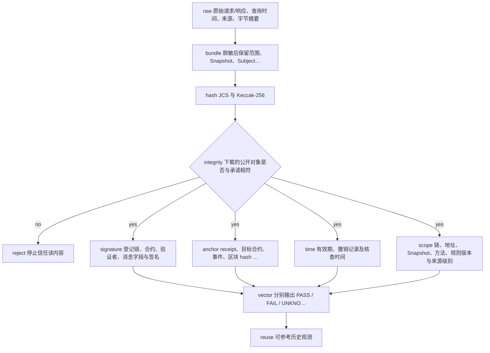

| 图内名称 | 中文含义 |
| --- | --- |
| Private raw artifacts | 原始请求/响应、查询时间、来源、字节摘要 |
| Build immutable public report | 脱敏后保留范围、Snapshot、Subject、检查和局限 |
| Canonicalize + hash | JCS 与 Keccak-256；内容不含自身 hash 或链上状态 |
| Content hash matches? | 下载的公开对象是否与承诺相符 |
| Integrity FAIL | 停止信任该内容；保留原声明和原因 |
| Signer + domain | 登记链、合约、验证者、消息字段与签名 |
| Current chain observation | receipt、目标合约、事件、区块 hash 当前是否匹配 |
| Validity + revocation | 有效期、撤销记录及核查时间 |
| Scope + assurance | 链、地址、Snapshot、方法、规则版本与来源级别 |
| Verification vector | 分别输出 PASS / FAIL / UNKNOWN，不压成安全总分 |
| Historical selection signal | 可参考历史观测；新调用仍需准入与验收 |

- 未签名的报告也可核对内容；其 signer 与 anchor 仍为未验证。
- URI 丢失时链上 hash 不能恢复原文；明确显示内容不可用。
- 单验证者证据和双 RPC 一致性均有信任假设，不能写成无条件真实或密码学状态证明。

异常覆盖：SC-A06、SC-D05、SC-B06、SC-B08、SC-B09、SC-B10、SC-B11。详细处理与验收见 `review/Scenario_Coverage.md`。

## D09. 链上登记与结果不明

Publication 表示登记工作进度；AnchorObservation 表示后来某次对当前主链的核对。

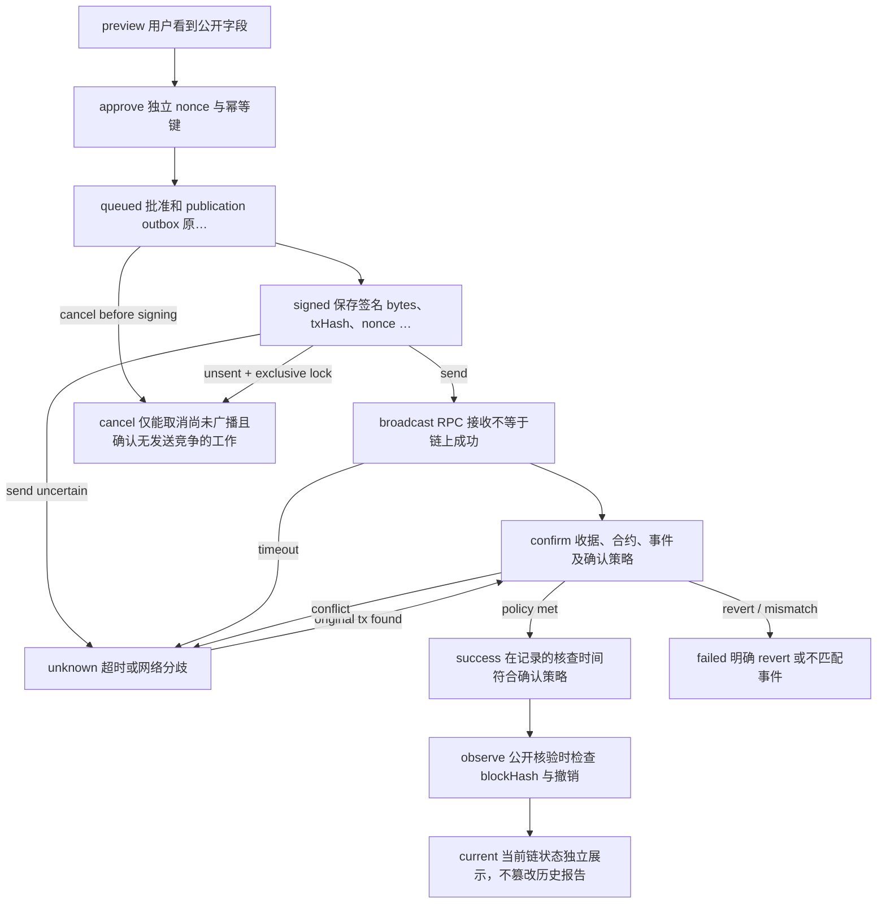

| 图内名称 | 中文含义 |
| --- | --- |
| Preview exact reportHash | 用户看到公开字段 |
| Approve publication | 独立 nonce 与幂等键 |
| QUEUED | 批准和 publication outbox 原子提交 |
| SIGNED + persisted tx | 保存签名 bytes、txHash、nonce 后才发送 |
| BROADCAST | RPC 接收不等于链上成功 |
| UNKNOWN | 超时或网络分歧；按原 txHash 查询 |
| CONFIRMING | 收据、合约、事件及确认策略 |
| CONFIRMED history | 在记录的核查时间符合确认策略 |
| FAILED | 明确 revert 或不匹配事件；不冒充成功 |
| CANCELLED locally | 仅能取消尚未广播且确认无发送竞争的工作 |
| Observe current chain again | 公开核验时检查 blockHash 与撤销 |
| CANONICAL / ORPHANED / UNKNOWN | 当前链状态独立展示，不篡改历史报告 |

- P0 不自动提价换 nonce；同一已批准交易的重发恢复策略需记录，费用上限变化需新授权。
- 广播后的“停止”不能撤回已公开记录。撤销是一条新的公开记录，也不会删除旧数据。
- 确认后若重组，当前显示 ORPHANED 或 UNKNOWN；不能继续用历史 CONFIRMED 单独证明当前仍有效。

异常覆盖：SC-B01、SC-B02、SC-B03、SC-B04、SC-B05、SC-B06、SC-B07、SC-B08、SC-B10。详细处理与验收见 `review/Scenario_Coverage.md`。

## D10. 数据采集与同步

大量数据的价值来自来源、版本和可复核性；缓存命中不能代替新鲜度规则。

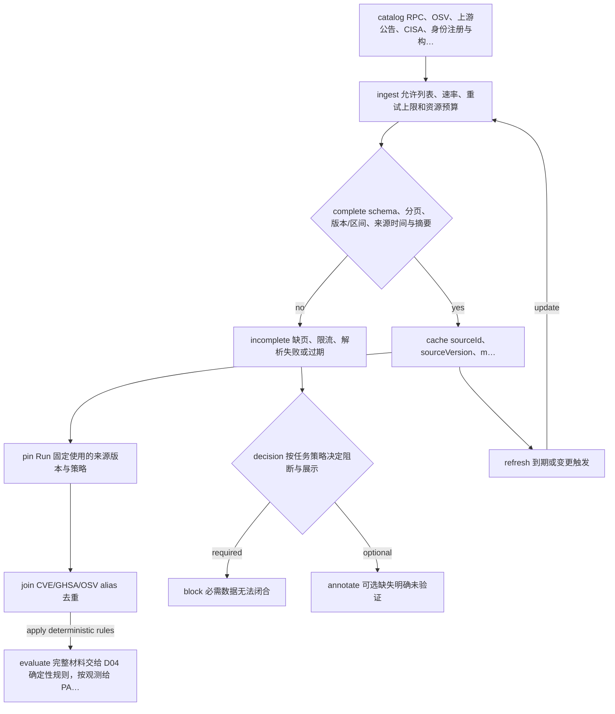

| 图内名称 | 中文含义 |
| --- | --- |
| Source catalog | RPC、OSV、上游公告、CISA、身份注册与构建材料 |
| Bounded ingestion | 允许列表、速率、重试上限和资源预算 |
| Complete and valid? | schema、分页、版本/区间、来源时间与摘要 |
| INCOMPLETE / STALE | 缺页、限流、解析失败或过期；禁止当作无风险 |
| Versioned evidence cache | sourceId、sourceVersion、modified、fetchedAt、hash |
| Pin run evidence | Run 固定使用的来源版本与策略 |
| Normalize and deduplicate | CVE/GHSA/OSV alias 去重；不算多份独立证据 |
| Return resolved evidence | 完整材料交给 D04 确定性规则，按观测给 PASS/FAIL，不因 required 就隔离 |
| Required or optional? | 按任务策略决定阻断与展示 |
| QUARANTINE | 必需数据无法闭合 |
| Continue with limitation | 可选缺失明确未验证 |
| Background refresh | 到期或变更触发；安全禁用只能收紧权限 |

- OSV querybatch 按每个查询项继续分页；截断不能等同无公告。
- 客户端锁文件、服务方 SBOM 声明和远程实际部署证明是三类材料；来源权威不能补足部署关联。
- 参考 RPC、模型、依赖源及候选服务各有独立预算；“最多两次服务调用”不表示总外部请求只有两次。

异常覆盖：SC-T08、SC-D07、SC-D08、SC-D09、SC-D10。详细处理与验收见 `review/Scenario_Coverage.md`。

## D11. 构建部署与交付停点

同一产物进入测试与演示，使用明确的 LIVE、REPLAY、SAMPLE 标识。

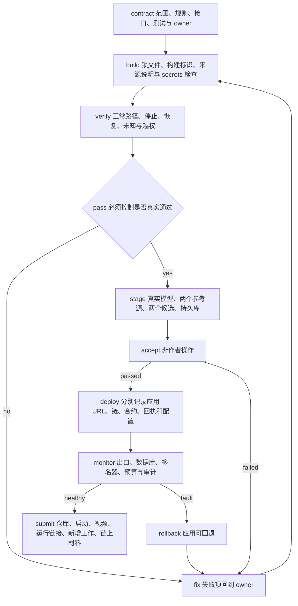

| 图内名称 | 中文含义 |
| --- | --- |
| Freeze reviewed contracts | 范围、规则、接口、测试与 owner |
| Reproducible build | 锁文件、构建标识、来源说明与 secrets 检查 |
| Contract + adversarial tests | 正常路径、停止、恢复、未知与越权 |
| Release gate passes? | 必须控制是否真实通过 |
| Fix or reduce claimed scope | 失败项回到 owner；不改为绿色演示 |
| Staging with real dependencies | 真实模型、两个参考源、两个候选、持久库 |
| End-to-end acceptance | 非作者操作；保留 trace、耗时、成本和接管次数 |
| Deploy exact artifact | 分别记录应用 URL、链、合约、回执和配置 |
| Readiness + recovery check | 出口、数据库、签名器、预算与审计 |
| Competition materials | 仓库、启动、视频、运行链接、新增工作、链上材料 |
| Operational rollback | 应用可回退；迁移按兼容方案，链上记录保留 |

- 本地 schema/逻辑检查、浏览器检查、实际 API 和链上确认分别登记，不互相替代。
- 主网 gas 不足或配置缺失显示 blocked；赛后补部署不改变比赛作品截止时间。
- GCC 以服务验收和 Ethereum 信任职责为主线；BOT 部署材料只证明相应链上的真实接入。

异常覆盖：SC-A01、SC-A02、SC-A07、SC-O01、SC-B01、SC-E01、SC-E02、SC-E05。详细处理与验收见 `review/Scenario_Coverage.md`。

## D12. 创新假设与市场验证

原生余额查询是控制与验收试验，商业价值需在真实接入成本和失败损失中验证。

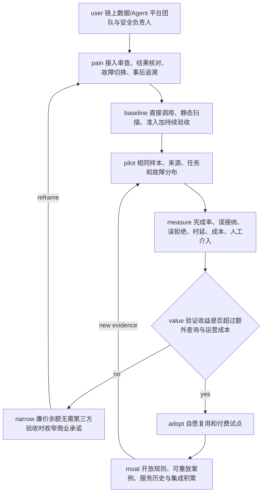

| 图内名称 | 中文含义 |
| --- | --- |
| Target teams | 链上数据/Agent 平台团队与安全负责人 |
| Measure current work | 接入审查、结果核对、故障切换、事后追溯 |
| Three baselines | 直接调用、静态扫描、准入加持续验收 |
| Matched pilot cases | 相同样本、来源、任务和故障分布 |
| Measure utility + cost | 完成率、误接纳、误拒绝、时延、成本、人工介入 |
| Net value demonstrated? | 验证收益是否超过额外查询与运营成本 |
| Narrow or change use case | 廉价余额无需第三方验收时收窄商业承诺 |
| Repeat paid use | 自愿复用和付费试点；不是主观打分 |
| Reusable evidence assets | 开放规则、可重放案例、服务历史与集成积累 |

- 已有依赖安全与 Agent/MCP 扫描产品；不能以产品名称不同推断市场空白。
- 候选差异化是任务相关验收、受限执行、可复核的公共失败记录与停止恢复；仍需需求和成本证据。
- 开放方法与案例形成公共物品；企业收费可来自托管、私有策略、监控和集成，不能以收集隐私日志建立壁垒。

异常覆盖：SC-B11、SC-E03、SC-E04。详细处理与验收见 `review/Scenario_Coverage.md`。

## 4. 数据的权威性、可获得性与同步

“来源权威”“数据完整”“适用于本任务”“证明真实”是不同条件。每份证据保存原件摘要、sourceId、operatorId 或上游、sourceVersion、fetchedAt、适用范围、完整性与新鲜度状态；不要用一个安全分替代这些信息。

| 数据/来源 | 获取与同步设计 | 可以支持的结论 | 不能支持的结论与失败处理 |
| --- | --- | --- | --- |
| Ethereum JSON-RPC 与 EIP-1898 [S1–S2] | 两个配置上独立运营者；逐 Run 固定共同 finalized 区块；取原始请求/响应 | 指定区块请求下的数量交叉一致 | 原生 eth_getBalance 只返回 QUANTITY，不带区块证明；不一致或缺能力则隔离 |
| OSV 官方 API [S3] | 精确生态/包名/版本批量查询；每个查询各自处理 next_page_token；必要时取完整公告 | 在采集时可检索到的已知受影响情况 | 缺页或失败不等于零漏洞；远程服务的实际部署也不能由客户端锁文件证明 |
| 公告上游与官方维护者 | 由公告链接追溯上游，保留 aliases 和修改时间 | 对版本区间与修复声明的来源追踪 | OSV、GHSA、CVE 同源记录不能算多个独立证明 |
| CISA KEV 官方镜像 [S4] | 以官方发布数据与版本记录增量同步；追踪原始政府目录 | 已知被利用漏洞的优先处置线索 | 未列入不代表未被利用或安全；P0 补充信号，不取代 OSV 完整性 |
| 自有 lockfile、构建摘要、SBOM | 不安装包；锁定文件 hash、生成方式和实际构建关联 | 自己控制的具体客户端构建材料 | 外部上传 SBOM 默认只是声明；无部署绑定不能写“远程代码已核验” |
| Ethereum 身份注册 [S5] | 从明确 chainId/registry/agentId 读取，固定观察区块与时间 | 该注册位置的身份引用及当前观察 | 注册不保证能力或善意；当前适配未完成，UI 显示未验证 |
| 本系统调用与停止日志 | 每阶段落库、单调事件序号、请求/响应原件私有保存 | 本系统观察到的行为与决定 | 本系统有漏记或存储故障时不能猜测远端执行结果 |
| BOT 回执与登记事件 [S6] | 核对 chainId、合约、receipt、事件、当前 blockHash 与确认配置 | 记录在该网络的登记事实与当前观察 | hash 无法恢复丢失内容；广播不等于确认；确认不等于内容真实 |

初始同步策略是设计参数：OSV 缓存最长 1 小时；单 Run 参考 RPC 上限 12 次、公告 HTTP 请求上限 20 次；候选调用预算仍是 2 次。完整命中的缓存可复用，但必须满足版本及新鲜度策略；超限而未取全则 required=INCONCLUSIVE。后台更新产生新证据版本，当前 Run 不被静默改写。规模化阶段应先建立版本化公共缓存、批量查询和增量更新，再扩大包生态与任务类型。

数据访问前需记录接口凭据、配额、可用区域、条款与是否可公开再分发；此设计未获得任何服务的无限配额或实时性承诺。API 可访问性是启动 readiness 与持续健康检查的对象，不能由“官网存在”推断。

## 5. 威胁模型与边界

| 边界 | 典型威胁 | 预防/检测/恢复 | 残余风险 |
| --- | --- | --- | --- |
| 用户 → Control | 越权取证、重复批准、旧版本重放、CSRF | owner 从会话派生；对象级鉴权；幂等键与版本；Cookie 部署加 CSRF | 会话被盗仍需限额和撤销；前端不是安全边界 |
| 服务文本 → Agent | 间接提示注入、伪造能力、诱导提权 | 规范化字段；工具允许表；模型建议二次校验；解释用事实引用 | 无法保证检测所有文本攻击；后端权限必须独立成立 |
| 工具/包 → 运行环境 | 安装脚本、污染锁文件、恶意 stdio | P0 不自动安装或执行上传配置；锁文件只读；部署依赖固定 | 自身运行时供应链也要维护；扫描结果不是安全认证 |
| URL/DNS → 网络 | SSRF、重绑定、重定向泄密、元数据读取 | 登记 origin；实际连接地址约束；TLS 主机校验；禁止未获准重定向 | 仅检查一次 DNS 不充分；各出口都须适用，包括参考/公告访问 |
| 响应 → 解析/存储 | 超大内容、解压炸弹、深层 JSON、脚本或日志注入 | 解压后字节/深度/时长限制；unknown→schema；文本渲染；日志白名单 | 大规模拒绝服务仍需平台配额与熔断 |
| Worker → DB/Gateway | 重复消费、旧租约、停止竞争、丢失 ACK | 原子 outbox/CAS；fencing；单次 jti；按原任务核对 | 网络外部副作用无法获得全局 exactly-once 保证 |
| Evidence → 公共存储 | 泄密、可关联地址、内容篡改、URI 丢失 | 私有原件和公开对象分离；精确字段预览；摘要与备份 | 公开副本难以删除；只在明确批准后公开 |
| Publication → Signer/链 | 密钥泄漏、错链、错合约、nonce 冲突、重组 | 隔离签名；链/合约/方法/预算允许表；发送前持久化；当前链再核查 | 单验证者仍是信任点；P0 固定验证者不能假称可在线轮换 |

MCP 官方安全指南支持授权受众、禁止 token passthrough、SSRF 与代理边界等控制；这些属于协议与工程边界，不能仅靠提示词实现。[S7] NIST SSDF 用于组织需求、保护、开发和漏洞响应工作，不是本项目已获认证的证明。[S10]

## 6. 页面、动作与异常反馈

界面主导航为“任务”“运行”“证据”“公开核验”；管理员另有“服务与策略”。用户应随时知道：我批准了什么、现在在哪一步、已消耗多少、能否停止、哪些仍未知。技术细节放在证据展开层，默认先给明确原因和下一步。

| 页面/状态 | 必需显示 | 动作与限制 | 异常反馈 |
| --- | --- | --- | --- |
| 输入/NEEDS_INPUT | 支持链、只读范围、缺少条件 | 补答；不猜地址；不执行 | 不支持转账/ERC20 时明确范围 |
| 批准/AWAITING_APPROVAL | 地址、链、资产、候选、固定区块方式、预算、版本 | 修改或批准；内容变更使 nonce 失效 | 旧版本 409 后重新展示，不自动批准 |
| 批准 ACK_UNKNOWN（仅客户端） | 原 taskId、确认状态未知 | 查询原任务；保留原幂等键 | 不创建另一个任务掩盖不确定性 |
| 运行/QUEUED、RUNNING | 当前阶段、候选与实际消费、来源时间 | 独立停止；查看分项证据 | 模型慢、事件断开不应锁住停止入口 |
| STOP_REQUESTED | 控制已确认、在途请求可能仍被处理 | 查状态；不再新增逻辑调用 | 无 ACK 只能显示停止未确认 |
| SUCCEEDED | 已验收事实、Snapshot、assurance 和局限 | 查看证据；新任务；公开预览 | 不能用“安全可信”覆盖 optional 未验证 |
| FAILED / QUARANTINED | 确定失败或必需未知的具体区别 | 修复配置后新任务；不续用旧批准 | 隔离不自动指控服务恶意 |
| CANCELLED | 已停止本系统后续执行，既有调用记录 | 查看停止证据；新任务 | 不承诺远端撤回或链上删除 |
| 公开预览 | 真正公开字段、reportHash、目标链与费用上限 | 单独确认；关闭预览不产生签名 | 内容变化后重新预览与确认 |
| 登记状态 | QUEUED/SIGNED/BROADCAST/CONFIRMING/UNKNOWN/CONFIRMED | UNKNOWN 查询原 hash；已有广播不提供“撤销交易”假按钮 | 网络、Gas、签名与合约错误分项说明 |
| 公开核验 | 内容、签名、当前链、有效期、撤销、范围各自结果 | 读取原件、导出证据 | 当前 ORPHANED 不被历史确认徽章遮盖 |

合同使用 `CheckStatus.INCONCLUSIVE` 表示证据未知；图里的 UNKNOWN 在核验语境是其人类可读描述，在 Publication 中才是确切状态枚举。ACK_UNKNOWN、offline、loading 均为客户端视图，不增加 TaskStatus。

键盘焦点、按钮名称、颜色之外的文字提示、读取错误与断线提示属于验收要求。当前离线原型完成本地逻辑检查，但尚未做真实浏览器的移动端布局与原生键盘验收；完整图谱不等于所有异常均已做成交互页面。

## 7. 部署、数据模型与工程分工

P0 建议模块化单体 API 加独立 Worker，复用同一个持久数据库和 outbox。将不可信外部访问、模型连接和签名权限分开；不必为每个逻辑模块部署微服务。前端只接 Control；服务令牌、内部 JWS 密钥和链上私钥不进入浏览器或模型上下文。运行栈可沿用已有可运行框架，遵守同一合同；本包未安装或锁定实际生产依赖。

| 环境 | 数据与秘密 | 出口与权限 | 必须证据 |
| --- | --- | --- | --- |
| 本地设计 | 全部 SAMPLE、无秘密 | 无网络的交互 HTML | 文件与逻辑检查记录 |
| 集成 | 专用测试数据、受控真 RPC/模型凭据 | 显式允许源；可控异常服务 | LIVE trace 与可复现故障记录 |
| 演示发布 | 冻结构建、用户输入最小化 | 独立认证与限额；禁止开发私网例外 | 干净环境启动、链接、日志与视频 |
| 主网登记 | 专用低额度 signer，秘密独立管理 | BOT 677、固定合约与方法、费用上限 | 真合约代码、交易、事件、当前链核查 |

| 持久对象 | 关键绑定 | 约束 |
| --- | --- | --- |
| Task / TaskSpec | owner、revision、specHash | 一个批准对应确定范围；审批幂等 |
| Run | taskId、Snapshot、policyHash、epochs、leaseGeneration | 只有当前代际执行；终态不可反写 |
| Attempt / Dispatch | Run、subject、manifest、jti、预算 | 消费与 dispatch 同事务；外部结果未知也记已消费 |
| InvocationObservation | 请求 hash、请求区块、bindingKind、可选服务声明、响应 hash | 原生 RPC 不伪造服务声明；LIVE 通过须可追溯原件 |
| EvidenceArtifact | 私有原始字节、内容 hash、归属任务 | 对象级鉴权、大小与保留策略；不自动执行内容 |
| PublicReport | spec、policy、subject、snapshot、attempt、事实与局限 | 不可变；不含自身 hash 或动态回执 |
| Publication | 批准 reportHash、签名 bytes/txHash、nonce、历史进度 | outbox 持久；批准、发送与取消有独占竞争规则 |
| AnchorObservation | txHash、回执块、当前主链块、checkedAt | 当前核查与历史 CONFIRMED 分离 |
| Event / Outbox | 聚合对象、唯一命令 ID、单调序号 | 至少一次投递时消费者幂等；客户端按序补读 |

责任角色可由一人兼任，但每个交付必须有唯一负责人和复核者。Control/Worker 负责 I01/I05–I07；Data/Verifier 负责固定 Snapshot 与证据完整性；Security/Gateway 负责出口、准入与密钥边界；Chain 负责签名和主链核查；Frontend 负责状态真实性与可恢复交互；QA/PM 负责真实验收、演示与材料。图谱和场景文件是共同合同，字段变更先更新 schema，再更新实现与回归。

工程规则：TypeScript strict；外部结果从 unknown 校验；金额/链/区块使用精确字符串；SQL 参数化；统一 traceId；UTC 记录与单调超时分开；秘密脱敏；版本固定并保留组件来源。事件与日志不能包含访问令牌、完整模型提示或私钥。私有原件保留时长与删除权限需要试点约定；公开报告说明不可保证删除第三方副本。

## 8. 验收、交付与比赛表达

门槛是通过/阻断，不以未实测的百分比代替。停止确认时延、任务 p50/p95、额外 RPC/模型开销先采样；在有数据前不承诺“毫秒级”“99.9%”或“100%防注入”。负向用例通过不代表开放世界无风险。

| 门槛 | 必须可重现的行为 | 阻断时怎么交付 |
| --- | --- | --- |
| G0 来源就绪 | 模型、两参考源、两候选、公告缓存与环境配置已核查 | 对应能力标未接入；不把 SAMPLE 计入真数据成绩 |
| G1 核心闭环 | 同一 scope/snapshot 的真实正常调用与一次受控失败切换 | 缩到能跑通的只读模板，保留真实失败 |
| G2 授权与恢复 | 重复批准、旧 ticket、停止两种竞争、旧租约、消费前后崩溃 | 阻断宣称“可安全自动执行”，列出未覆盖项 |
| G3 证据 | 私有原件可核对、公开 hash 正确、篡改失败、无秘密泄漏 | 不开放公共发布功能 |
| G4 链上 | 正确网络/合约/签名/回执/事件/当前区块，明确确认策略 | 显示发布不可用；不计有效主网部署 |
| G5 交付 | 非作者从干净环境启动、链接可访问、材料与新增工作清晰 | 保留明确范围的演示录像与问题记录 |

建议用同一组正常与受控异常任务比较三种基线：直接调用、一次静态检查、持续任务验收。首轮可各准备至少 10 个正常和 10 个受控异常案例，记录配置和选择理由；这是冒烟与对照设计，样本量不足以宣称普遍检出率。报告正常完成数/总数、错误接纳数/异常数、误拒绝数/正常数、人工介入次数、耗时分布和包括参考/模型/链的总成本。不能通过拒绝所有任务获得虚假的高安全成绩。

| 通用评分维度 | 权重 | 本方案要拿出的事实 | 演示重点 |
| --- | --- | --- | --- |
| 技术完成度 | 20% | 可运行真实闭环、失败与恢复记录 | 正常→失败拒绝→获准备用；运行中停止 |
| 创新性 | 20% | 与直接调用/静态检查的增量对照 | 按任务验收、准入与履约证据的闭环 |
| 场景价值 | 20% | 具体目标用户、当前人工流程、试点收益 | 为什么用户愿意增加这层控制 |
| 赛道结合度 | 20% | Ethereum 真实数据与身份/验证职责；BOT 真登记证据 | 区块链具体承担什么、哪些仍链下 |
| 表达质量 | 20% | 清楚区分已实现/计划、来源/声明、确定/未知 | 用原始证据回答失败原因和边界 |

评分依据来自用户提供的赛手册；分赛题要求作为这些维度的判断依据，不另加权。GCC 主线需要落实 Ethereum 跨主体信任职责，当前身份适配仍是停点；BOT 的主办方 20–25 项目部署目标不转化为本队得分或最低部署数量。BOT 有效部署需真实 Mainnet 浏览器链接、交易记录和适用地址，不能用测试网或领取 Gas 替代。

4 分钟终评建议：0:00–0:30 用户问题与范围；0:30–1:50 真实失败发现及受控切换；1:50–2:25 停止/未知处理；2:25–3:15 证据核对与实际链上状态；3:15–4:00 对照结果、公共物品、已实现边界。六分钟轮评增加原件核查与问答。录像标注 LIVE/REPLAY/SAMPLE，不能把它们混成实时演示。

按手册，2026-10-08 12:00 北京时间截止，建议 11:30 前完成上传。优先固定范围→真实闭环→停止与证据→链上核验→干净环境与材料。09:00 后冻结功能，10:30 前完成交付检查；这些是倒排门槛，不是已完成进度或保证能从零赶工完成。

## 9. 创新与市场验证

Snyk 官方 Agent Scan 已涉及 Agent/MCP/技能安全检查；Socket 官方 MCP 提供依赖风险查询。这足以否定“没有相关产品”的推断，不能反过来仅凭其文档未提及某功能，就断定其没有该能力。[S8–S9]

| 待验证假设 | 本方案可能形成的差异 | 需要收集的证据 | 否证后调整 |
| --- | --- | --- | --- |
| 工具接入有重复人工核查成本 | 可复用的任务验收合同与入口策略 | 真实接入步骤、工时、现有替代工具 | 简化为现有网关/扫描器插件 |
| 静态扫描无法回答当前服务是否履约 | 固定范围的实时观测、交付验收和受控切换 | 同任务的静态/连续对照结果 | 删去无增益检查，减少延迟与成本 |
| 团队需要跨主体核验记录 | 主体绑定、不可变报告、独立核查与可选链上承诺 | 外部团队实际核验/复用、争议处理案例 | 不强迫每次调用上链；保留导出签名报告 |
| 用户愿为持续管理付费 | 托管连接器、私有策略、监控和集成 | 有预算责任人的试点、重复使用和明确采购信号 | 缩小目标客户，暂停规模扩张 |
| 开放案例可形成长期优势 | 可复跑案例、验收模板与贡献标准 | 第三方复用、修正率、贡献和兼容记录 | 优先维护少数可靠模板，避免堆砌数据量 |

首批访谈建议覆盖 3–5 个团队中的 Agent 开发者、平台/安全负责人和实际采购者；分别记录事实、推测和承诺，不把口头兴趣当市场验证。潜在壁垒来自可信模板、集成深度与复核网络；区块链存在本身不会带来先发优势。公共物品部分可开放规则、案例格式、验收器和去敏报告；私有原件、企业策略与秘密保持受控。发布代码前明确自有与第三方许可，未审查组件不承诺任意再分发。

## 10. 变更与证据要求

新增协议、链、资产、可写工具或高风险自动动作时，必须建立新的 TaskSpec、威胁模型、权限、失败分类和验收用例，不在现有原生余额接口中塞入隐式分支。每次事故新增 SC 编号，关联检测规则、修复提交、回归证据与负责人。回滚服务版本不能删除已经公开的链上历史；密钥受损时先冻结新签名，再公开可核对的后续状态。

`review/Scenario_Coverage.md` 是逐场景交接单，`contracts/scenario_catalog.json` 是机器可读版本。通过情况必须补充 testRunId、构建版本、运行模式、输入摘要、断言及原始 trace；当前这些执行证据未生成，不以设计文档代填。

## 11. 原始资料

以下为本次直接核查的一手资料，访问日期 2026-10-07。技术文档支持协议事实与工程约束；本方案架构、预算、分工和市场假设是设计判断。比赛日程与评分以用户提供的手册为依据，未将其当作已经独立核实的官方公告。

- [S1 Ethereum JSON-RPC](https://ethereum.org/developers/docs/apis/json-rpc/)：eth_getBalance 的数量返回及区块参数。
- [S2 EIP-1898](https://eips.ethereum.org/EIPS/eip-1898)：按 blockHash 与 requireCanonical 查询。
- [S3 OSV querybatch](https://google.github.io/osv.dev/post-v1-querybatch/)：每个查询的分页与返回格式。
- [S4 CISA KEV 官方数据仓库](https://github.com/cisagov/kev-data)：政府已知被利用漏洞目录的官方镜像。
- [S5 ERC-8004](https://ercs.ethereum.org/ERCS/erc-8004)：身份/信誉/验证注册及其信任边界。
- [S6 BOT Chain Quick Guide](https://dev-docs.botchain.ai/docs/Developers/quick-guide/)：主网 677 与测试网 968 的区分。
- [S7 MCP Security Best Practices](https://modelcontextprotocol.io/docs/2026-07-28/tutorials/security/security_best_practices)：授权、令牌与网络安全边界。
- [S8 Snyk Agent Scan 官方仓库](https://github.com/snyk/agent-scan)：相邻产品已覆盖的安全检查范围。
- [S9 Socket MCP 官方文档](https://docs.socket.dev/docs/guide-to-socket-mcp)：依赖风险查询能力。
- [S10 NIST SP 800-218 SSDF v1.1](https://csrc.nist.gov/pubs/sp/800/218/final)：安全开发实践的组织依据。

原始 PRD 另列 RFC 8785、RFC 8725、签名实现文档及 AgentDojo/InjecAgent 同行评审论文。本图谱不引用未经同行评审的市场规模或准确率作为已证实事实。
