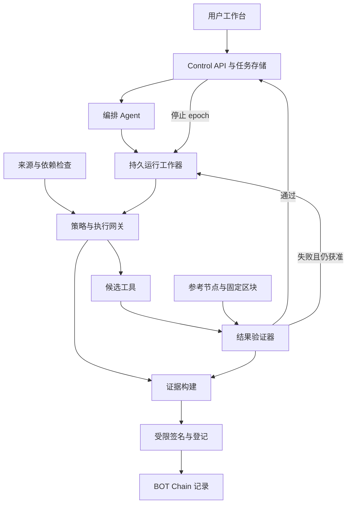
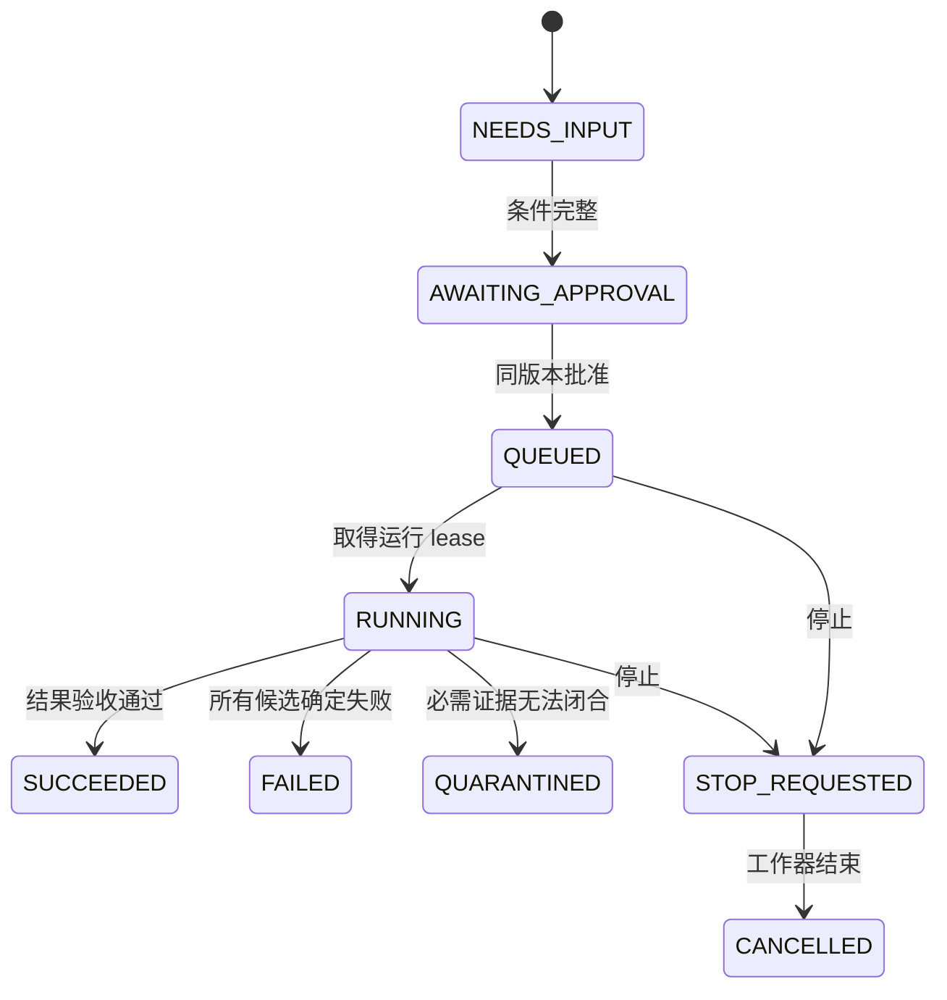

# Agent 工具与依赖准入检查器研发设计基线

版本 0.2。日期 2026 年 10 月 7 日。适用汉客松 S1 与 ETH Wuhan 2026。读者为产品、Agent、后端、合约和前端负责人。

首发帮助以太坊研究 Agent 完成一次可靠的只读查询：用户批准明确的任务范围，系统检查候选工具，在执行网关限制下查询，以固定参考区块验收结果；失败时在原授权内切换，随后生成可复核的证据。依赖与来源检查分别展示，公开记录用于共享观测。此基线定义研发要求与交互，不代表后端、在线模型或主网已实现。随附交互原型全部使用构造样例。

**1 产品范围与目标**

首发用户是需要调用陌生数据服务的链上研究人员及 Agent 开发团队。平台或安全负责人管理候选服务与策略，使用者批准自己的任务。公共证据的读者可核查历史记录，但不因此获得原用户的权限或私有日志。

| 优先级 | 范围 | 完成判据 |
| --- | --- | --- |
| P0 | Ethereum mainnet 原生 ETH 余额核对 | 指定地址、固定区块、两家候选服务，返回经核验的 wei 字符串 |
| P0 | 自然语言输入、补答及批准 | 一个编排 Agent 输出有限任务结构；后端验证；同版本批准 |
| P0 | 工具准入与调用限制 | 方法、参数、调用者、版本、预算和停止状态在后端生效 |
| P0 | 失败验收与切换 | 首个服务失败后最多切换一次，仍在同一任务与区块范围内 |
| P0 | npm 依赖输入 | 静态锁文件样例与 OSV 公告查询；不运行不可信包 |
| P0 | 停止、证据及公开核对 | 独立停止入口；公开内容摘要核对；锚定有独立状态 |
| P0 | BOT 主网登记 | 实际合约、交易及对应事件可核查；未完成则标记未部署 |
| P1 | 交易回执、ERC-20、历史区块查询 | 各自增加输入合同、精度规则与测试，不复用余额规则冒充覆盖 |
| P1 | 任意 URL 注册、stdio、构建来源证明 | 先建立 SSRF 防护、执行隔离和部署证明要求 |
| P1 | 多验证者、争议、信誉聚合 | 先定义验证者选择、相关性、撤销与复核 |

比赛实现只支持 `FINALIZED_AT_RUN` 余额任务；合同预留历史区块模式，但接口收到未启用模式应返回 `UNSUPPORTED_SCOPE`。没有交易发送、钱包托管、自动购买数据或资金授权。模型推理预算与数据服务调用预算分别计算。

首发流程只选择管理员登记的两个候选服务。登记代表允许进行受限接触，不代表服务回答可信。普通用户不能通过提交 URL 改变网络范围。开发环境对本地样例的例外配置单独记录，不带入公开部署。

**2 用户故事与产品需求**

| 编号 | 用户故事 | 验收要求 |
| --- | --- | --- |
| FR01 | 研究人员输入“核对这个地址的 ETH 余额” | 识别链、地址、资产、快照模式；不推测缺失地址，不替换成其他资产 |
| FR02 | 用户补充缺失条件 | 补答更新任务 revision 和 spec 摘要，旧批准及批准 nonce 失效 |
| FR03 | 用户查看具体授权 | 展示地址、Ethereum、原生 ETH、执行时 finalized、候选与最多调用/切换次数 |
| FR04 | 用户批准本次查询 | 仅对当前 specHash 与 revision 批准；重复点击返回同一运行 |
| FR05 | Agent 选择合适服务 | 只从许可候选提出选择；后端按能力和范围复核，不通过语言模型扩大权限 |
| FR06 | 系统核对工具声明 | 固定工具名、schema、manifest 摘要；变化使旧凭据失效 |
| FR07 | 系统查看依赖与来源 | 区分本次客户端锁文件、服务方声明、已证明产物；缺失项明确显示 |
| FR08 | 用户查看结果 | 只有 mandatory 验收全通过的事实进入正常结果；失败值只在证据中展示 |
| FR09 | 首选服务返回旧快照 | 按本次参考区块拒绝；在批准范围内最多切换一次 |
| FR10 | 用户停止运行 | 按钮不随普通请求 busy 锁禁用；停止入口不经过 LLM 或调用队列 |
| FR11 | 网络慢或参考来源冲突 | 不静默通过；显示待核验或失败及下一步操作 |
| FR12 | 用户阅读证据 | 看见具体规则、期望与观测、来源、时间、范围和未覆盖项 |
| FR13 | 用户准备公开证据 | 私有原始日志与公开摘要分开；预览实际将公开的字段及 reportHash |
| FR14 | 用户批准公开登记 | 只登记批准的 reportHash；内容变化后需重新确认；默认不自动发布 |
| FR15 | 另一位用户核查公共记录 | 分别核查内容摘要、签名主体、链上事件、有效期、撤销和适用范围 |
| FR16 | 团队验证赛道材料 | 私有运行成功与主网确认分别列出，未广播不显示成功交易 |

建议任务创建到首次明确状态、停止确认时延、调用额外开销及误拒绝率作为测量项。当前不填写未经测试的性能成绩。停止持久化目标为正常负载下 1 秒内；网络异常时 UI 必须显示“停止请求尚未确认”，不能自行宣布已停止。

**3 产品对象与术语**

| 对象 | 含义 | 关键约束 |
| --- | --- | --- |
| TaskSpec | 用户授权的规范化任务结构 | 不含原始提示或用户身份；链上数量、chainId 均用字符串 |
| Task | 私有任务与批准记录 | owner 从身份会话派生；ID 不是权限凭据；revision 单调增长 |
| Run | 一次已批准执行 | 固定 spec、策略与参考区块；一个任务批准对应一个当前 Run |
| Snapshot | 参考链与具体区块 | 保存 hash、number、采集时间、参考来源与 assurance |
| Subject | 服务或软件产物 | 对声明信息与已证实事实分别标记 |
| AdmissionTicket | 内部短期准入凭据 | 每个实际工具调用单独绑定；不发给浏览器或模型保存 |
| Attempt | 候选检查及一次调用记录 | 对检查拒绝、调用失败、验收失败、未知结果分别计数 |
| RuleCheck | 一条分项检查 | required、status、reasonCode、证据引用及未知原因 |
| PublicReport | 可公开且不可变的证据内容 | 不含私有提示、用户 ID、服务令牌；不含自身 hash、签名或上链状态 |
| Publication | 独立的公开登记工作 | 不改变原任务结论；保存交易及回执状态 |

检查状态为 `PASS / FAIL / INCONCLUSIVE / ERROR / NOT_CHECKED`。动作是 `ALLOW / REJECT / QUARANTINE`。某个 optional 项缺失不会自动成为任务失败，但它不能显示为已通过；required 项缺失则不能允许对应阶段继续。

例如：只读余额查询允许服务方部署信息未证明，但界面必须写“远程部署来源未验证”。如果客户选用要求部署证明的策略，同样缺失应隔离。准入只表示满足当前任务策略，不表示服务整体安全。

**4 逻辑架构与物理部署**

模型角色采用一个编排 Agent，解释可由同一模型在隔离上下文中完成。事实核验、签发与停止采用确定性代码。角色不同不代表必须有多个 Agent 进程。

| 模块 | 工作 | 不能拥有的能力 |
| --- | --- | --- |
| Web 工作台 | 输入、补答、范围批准、运行状态、停止、证据预览 | 私钥、服务密钥、直接访问工具后端 |
| Control API | 身份、Task、revision、批准、停止、事件流 | 不在事务内等待模型或外部网络 |
| 编排 Agent | 抽取有限需求，澄清，提出候选与解释证据 | 任意 URL、shell、写策略、钱包调用、自修改 |
| Run Worker | 持久执行阶段，取得 lease，调用内部模块 | 不能修改已批准范围或绕过停止 epoch |
| Inspection Worker | 清单固定、静态依赖查询、受限探测 | 不执行上传锁文件中的脚本或包安装命令 |
| Policy Engine 与 Gateway | 签发内部凭据，每次核对授权与预算再调用 | 不接受模型自报的 owner 或获批状态 |
| Reference Resolver 与 Verifier | 固定区块、参考来源核对、结果逐项验收 | 不将服务自报更新时间作为真实性证明 |
| Evidence Builder 与 Signer | 脱敏、JCS、摘要、签名及登记工作 | 签名密钥不进入模型；Signer 不接受任意交易 calldata |

物理上先采用一个 Web 前端、一个 Control/Worker 服务、一个受限签名进程和持久数据卷；检查工作器可隔离成容器。逻辑模块先不拆成多套微服务。只有网关能访问获准候选，参考核对模块能访问已配置参考来源，模型只能访问模型接口和本系统工具。

新建 Agent 运行时默认采用 eve，业务安全内核保持独立。Node.js 24 或更新版本、模型连接及 eve 文件目录以当前官方文档为依据；模型标识使用部署者配置的 AI Gateway 标识。已有可运行栈可保留，通过适配器实现相同合同，无需为比赛迁移。[1–3] 这份包没有安装或初始化 eve，也没有调用在线模型。

eve 开发模式的默认扩展包含自修改。受控演示应按官方方式使用 `eve dev --no-default-extensions`，且审查明确挂载的扩展；Agent 能力清单不能包含代码执行、自修改、任意外部连接或动态添加工具。生产启动时仍需检查最终发现的能力，不能仅依赖提示词禁止。[4]

建议逻辑目录为 `agent/`、`web/`、`server/control/`、`server/worker/`、`server/gateway/`、`server/reference/`、`server/verifiers/`、`server/evidence/`、`chain-contracts/`、`contracts/`、`fixtures/` 与 `evals/`。随附 `agent/instructions.md` 是应用 Agent 的提示规范，不是当前助手的技能安装包。

**5 Agent 行为与工具合同**

编排 Agent 收到用户需求后输出 TaskDraft，不直接执行链上查询。缺失地址或存在多个待选择地址时补问，不猜测；请求 ERC-20、其他链或交易发送时明确说明当前未支持。确定性编译器验证结构和用户原文对应字段，并生成 TaskSpec。链名、地址、资产、快照及切换范围均在批准卡中展示。

批准后，后端完成参考区块及策略准备；Agent 可根据已验证的能力事实提出首选服务。执行由运行工作器推进，模型只能通过受控业务工具取得已验收结果。解释阶段输入验收事实及证据 ID；报告构建器验证数值、地址和引用，生成错误或模型不可用时采用确定性文字模板。

| 模型可见工具 | 输入 | 输出 | 边界 |
| --- | --- | --- | --- |
| `task_get_scope` | taskId | 已批准范围与剩余预算 | owner 从运行上下文派生，不能由参数指定 |
| `service_list_eligible` | taskId | 已配置且符合范围的候选摘要 | 不回传恶意清单全文，不接受自定义 URL |
| `task_propose_service` | taskId、serviceId、理由引用 | 后端接受或拒绝选择建议 | 不是权限签发，不接受新增服务 |
| `task_get_verified_result` | taskId | 通过验收的事实或当前状态 | 未通过的响应不作为正常结果返回 |
| `evidence_get_summary` | taskId | 脱敏分项证据 | 原始响应、令牌和私有路径不可见 |

停止、策略修改、凭据签发、直接调用、公开发布和钱包签名均不是模型可见工具。内部工具如 `admission_evaluate`、`gateway_invoke`、`reference_resolve`、`result_verify`、`evidence_build` 只有相应工作器权限。机器合同见 `contracts/skill_contracts.yaml`。

每个实际调用使用一个内部签名凭据，绑定 taskId、runId、caller、TaskSpecHash、SnapshotHash、serviceId、manifestHash、method、argumentsHash、policyHash、stopEpoch、policyEpoch、leaseGeneration、到期时间及单次 jti。参数固定为所批准地址与本 Run 区块。签名器和网关密钥分别管理；模型不能读取凭据正文。

单服务部署可用经过验证的 JWS HS256 实现签发内部凭据，固定算法与 audience，不接受算法切换；网关密钥与 EIP-712 证据私钥分离。算法及接收者绑定采用 RFC 8725 的相关原则；这是本项目的内部 JWS 凭据合同，不宣称其自定义时间字段等同标准 JWT claim。[15] caller 由工作器上下文派生，不能从模型参数采信。多进程调用身份须结合受控进程凭据；仅把 caller 字符串放入凭据并不能证明持有者身份。approvalNonce、publishNonce、jti 采用密码学随机源生成，至少 128 bit 随机性，并在数据库中保存绑定和消费状态。

模型预算建议最多 4 个推理回合，单次最大输出 2,048 tokens；候选检查最多 2 次，实际服务调用最多 2 次，切换最多 1 次。它们是初始产品限制，不是已测成本或性能。所有预算由服务器配置上限校验，模型和浏览器不能提高。

**6 参考区块与结果验收算法**

P0 查询的是原生 ETH 的 `eth_getBalance`，结果以 wei 十进制字符串记录，展示时精确换算为 ETH。后端不使用浮点数保存余额，模型不计算金额或小数位。[5–6]

1. 两个配置上来自不同运营者的参考来源确认 `eth_chainId = 1`，各读取 finalized 头。来源独立性由配置和运营证据支持，不由两个 URL 的不同自动推断。
2. 若头高度偏差超过策略允许窗口，参考状态为 INCONCLUSIVE。取可共同核对的 finalized 高度并分别取该高度区块，hash 必须一致；不能通过简单多数把冲突隐藏。
3. 保存固定 Snapshot。`capturedAt` 表示系统采集时间，不是链上出块时间。finalized 区块自然早于当前时间，不能仅按几分钟的旧时间戳判错。
4. 对这个区块取得两个参考余额。P0 要求 EIP-1898 的 `blockHash` 与 `requireCanonical`；不支持时隔离。按高度查询的降级需要新版本策略与独立验收，不在 P0 启用；不能静默换成 latest。[6]
5. 候选服务收到同一地址与区块。原生 `eth_getBalance` 响应只有数量：`REQUEST_BOUND` 记录实际 EIP-1898 请求及响应，链、地址和区块来自请求及配置，不能伪装成服务回传证明。MCP 等增强服务若明确声明链、地址、区块，记为 `PROVIDER_DECLARED` 并核对声明。两种分支都要验证 schema、整数格式和参考余额。参考不一致时不能归咎某个服务恶意。
6. 服务明确声明的 blockHash 不符时拒绝快照；跳过跨区块的余额比较，避免把历史真实余额误报为虚假余额。snapshot 一致但余额不同才命中 `DATA_BALANCE_MISMATCH`。
7. required 检查全部 PASS，且 stopEpoch、policyEpoch 与当前工作器 leaseGeneration 均匹配，才能在数据库事务中提交已验收事实；否则拒绝或隔离。切换后仍使用这个 Snapshot，不换链、地址或区块。

原生 RPC 返回旧值但恰与参考值相等时，无法从该数量推知服务内部使用的区块；本系统只陈述可观察的一致性。LIVE 已验收 Attempt 必须持有可核对的 InvocationObservation、私有原件和摘要；SAMPLE 的空 observation 不能进入 LIVE。

参考核对是配置可信度下的交叉检查，assurance 写 `RPC_CROSS_CHECKED`，不能写密码学证明。轻客户端或 `eth_getProof` 加受信区块头可作为后续增强，但不在此次范围。

依赖检查优先采用 OSV，以生态、包名和确定版本查询，按返回 ID 取得完整记录并处理分页。记录 modified、fetchedAt、aliases 和原始响应摘要；OSV 与 GHSA 同源公告不当成两份独立证明。[7] 静态锁文件不触发安装。无真实部署证明的远程 SBOM 使用 `PROVIDER_DECLARED`，没有资料使用 `NOT_AVAILABLE`。

**7 状态机与停止的并发规则**

| 任务状态 | 用户看到的状态 | 可执行动作 |
| --- | --- | --- |
| NEEDS_INPUT | 等待补充地址或范围 | 补答、取消 |
| AWAITING_APPROVAL | 等待批准本次只读任务 | 修改、批准、取消 |
| QUEUED | 等待开始 | 停止 |
| RUNNING | 正在检查、调用或验收 | 独立停止、查看事件 |
| STOP_REQUESTED | 停止请求已确认，正在结束 | 查看状态；重复请求返回原状态 |
| SUCCEEDED | 本任务验收通过 | 查看证据、预览公开字段、新建任务 |
| FAILED | 已确定不能完成 | 查看失败、修改后新建任务 |
| QUARANTINED | 存在 required 未知或参考冲突 | 查看原因、修复配置后新建任务 |
| CANCELLED | 本系统已停止后续执行 | 查看停止记录、新建任务 |

草稿和待批准任务可直接 CANCELLED；图中省略这些重复路径。状态与阶段分别存储，阶段是 PLAN、REFERENCE、ADMISSION、INVOKE、VERIFY、REPORT、STOPPING、COMPLETE。完整允许转换见 `contracts/state_machines.json`。

`POST /v1/tasks/{taskId}/stop` 是独立控制入口。短事务写入 cancelRequestedAt，增加 stopEpoch，撤销未消费 ticket，并取消未启动的工作。网关调用前及提交结果前比较同一 epoch。前端不能共用会阻塞停止的 busy 锁。

外部只读请求可能已经发出，系统尝试取消本地连接，但不宣称远端未处理。晚到响应写为 LATE_DISCARDED，不能生成成功结果、触发切换或自动发布。停止与成功提交竞争时，以数据库先提交的有效转换为准；已 SUCCEEDED 的任务收到停止应返回终态，不改写成取消。停止历史不能覆盖事实。

网关将 ticket 消费与 DISPATCH_COMMITTED 在短事务中同时记录，停止确认后不得提交新的 dispatch。已在停止前提交的 dispatch 可能仍处于发送或远端处理阶段；产品不承诺在物理网络层即时撤回。STOP_REQUESTED 表示控制已持久化，CANCELLED 表示本系统后续工作已收尾，两者均不表示远端没有处理既有请求。

新任务不会复活旧 Run。运行 worker lease 到期后恢复器原子增加 leaseGeneration，旧代际禁止新消费和结果提交，再核查已消费 ticket 和 Attempt；只读请求超时仍可能被服务计费，调用预算已消耗，不盲目重发同一 nonce。可切换时另签新票据并计入剩余预算。

**8 API 与持久化合同**

OpenAPI 为 3.1；schema 为 JSON Schema 2020-12。请求与响应采用 `additionalProperties: false`，业务不变量额外由后端验证。所有私有端点从认证会话派生 owner，不能以请求体的 userId 替代。浏览器 cookie 鉴权需有 CSRF 控制；公共核验路由只读取获准链及 registry。

| API | 工作 | 一致性约束 |
| --- | --- | --- |
| POST `/v1/tasks` | 输入并生成任务提案 | 模型不可用返回配置错误，不能伪造在线理解 |
| GET `/v1/tasks/{taskId}` | 状态和已验收结果 | owner 校验；不回传签名密钥和内部 ticket |
| POST `/v1/tasks/{taskId}/clarifications` | 更新草稿 | revision 比对，旧批准失效 |
| POST `/v1/tasks/{taskId}/approve` | 同版本批准并入队 | 比对 revision、specHash、nonce；要求 Idempotency-Key |
| POST `/v1/tasks/{taskId}/stop` | 优先停止 | 不等待 LLM；重复调用安全；不要求前端等待运行请求 |
| GET `/v1/tasks/{taskId}/events` | 增量事件 | per-task sequence；客户端去重，断线后续读 |
| GET `/v1/tasks/{taskId}/evidence` | 私有最终证据 | 原件受控，只对任务 owner 开放 |
| GET `/v1/tasks/{taskId}/artifacts/{artifactId}` | 私有原始字节与内容摘要 | owner 与 task 归属都校验，返回数据不执行 |
| GET `/v1/evidence/{reportId}/public-preview` | 公开字段预览 | 返回稳定 publicReport 及 reportHash |
| POST `/v1/evidence/{reportId}/publications` | 批准登记 | 精确 reportHash 与 publishNonce；发布工作独立持久化 |
| GET `/v1/publications/{publicationId}` | 登记状态 | UNKNOWN、失败、确认分开 |
| POST `/v1/public/evidence/verify` | 公共核验 | 对内容、签名、链上、有效期分项；不会执行报告中的 URL 指令 |

同一 Idempotency-Key 仅在 owner 与操作范围内有效。同键相同请求返回既有结果，同键不同摘要返回 409。批准与运行 outbox 在一个数据库事务中提交，避免批准成功但任务丢失。公开批准与 publication outbox 也独立采用相同模式。

持久表至少包括 tasks、runs、approvals、subjects、tickets、attempts、rule_checks、task_events、private_artifacts、public_reports、publication_jobs 和 idempotency_records。唯一约束覆盖运行批准、ticket 消费、事件序号和 publicationId。SQLite WAL 与耐久卷可用于单机比赛部署；控制事务保持短，不在 DB 锁内调用外部服务。生产按并发、备份和租户隔离另行选型。

运行恢复、日志及反馈由应用 DB 作为任务状态事实来源。eve 对话恢复不能代替授权或票据数据库。事件记录只写脱敏错误原因；原始外部材料进入私有存储。调用 trace 保存原始响应摘要，摘要不能代替原件可用性。

**9 证据内容与链上登记设计**

PublicReport 固定 TaskSpec、Snapshot、各 Attempt 的分项检查、最终事实或 null、来源类别及未覆盖项。私有 owner、原始提示和令牌不进入这个对象。公开前展示将暴露的地址与任务范围，用户批准实际报告摘要。

公共评价必须能识别同一个服务。subjects 保存命名空间、公开服务 origin、固定 manifestHash 与可选 Ethereum 身份引用，subjectHash 对完整 subjects 计算；不能只对私有别名 svc_primary 求摘要就当成跨团队服务身份。origin 不含凭据，公共核验器不自动访问它。没有完成链上身份核对时 identityStatus=NOT_CHECKED，不能与另一部署中的同名服务聚合；私有 origin 不便公开时需以可验证身份引用或公开稳定标识补足。

摘要采用 `keccak256(UTF8(JCS(PublicReport)))`。只用合法 JSON 值；链上大整数为字符串；重复 JSON key、NaN、Infinity 与未支持表示应拒绝，不能只做“键排序去空格”。JCS 不自动修改 Unicode 表示，生产者和验证者必须遵循同一规范。[8] 原型的摘要算法是本地内容核对演示，生产实现采用经过验证的库和测试向量。

PublicReport 不包含 reportHash、签名和交易 hash。否则“报告包含自己的 hash”或“报告包含尚未产生的交易 hash”会形成循环依赖。它生成后不可改；签名信封与 AnchorReceipt 放在外层。新发现生成新版本报告，而非覆盖原内容。

签名信封采用明确的 EIP-712 domain，绑定 name、version、BOT chainId 677 与已部署 EvidenceRegistry。消息包含 reportHash、taskSpecHash、policyHash、subjectHash、sourceChainId、resultCode、evidenceURIHash、observedAt、expiresAt、nonce。UTC 时间转换成显式 uint64 秒；链与数量不能超过对应 uint 范围。公开验证要核查签名者及 domain，不能仅验签成功就信任任何 signer。[9]

登记合约 P0 使用固定可信验证者地址，只追加 records 和 revocations，不提供修改或删除。`submitEvidence` 保存上述摘要、sourceChainId、检查状态、URI 与验证者；不执行外部调用、不托管资产、不接收任意代理执行。撤销由原验证者追加并引用原记录。它是自定义证据登记合约，不宣称直接符合 ERC-8004；后续适配其验证或信誉接口。[10]

sourceChainId=1 表示被核验数据；registryChainId=677 表示存证位置，两者不可混淆。BOT 主网配置使用官方提供的 chainId、RPC 和浏览器，主网和测试网分别设置。[11] Signer 只接收已批准 hash 与固定合约方法，链、合约、gas 上限及每日预算在后端配置中校验。

`AnchorObservation` 单独记录当前 CANONICAL、ORPHANED、UNKNOWN、CONFLICT 或 NOT_CHECKED 及 checkedAt。历史 CONFIRMED 不自动证明当前仍在主链；每次公共核验重新核对，保留历史回执，不改写 PublicReport。

Publication 状态独立为 NOT_REQUESTED、QUEUED、SIGNED、BROADCAST、CONFIRMING、CONFIRMED、UNKNOWN、FAILED、CANCEL_REQUESTED、CANCELLED。广播不等于确认。确认必须核对 receipt 成功、目标合约、匹配事件和当前区块状态；BOT 的确认策略由部署联调记录配置，不能自动套用 Ethereum 的最终性参数。

签名交易在发送前保存 bytes、txHash 和 nonce；超时先查原 hash。需要重发时只能按同一已批准交易的恢复策略，不重新创建不相关交易。停止任务不会撤销已上链记录；上链广播后的取消也不能冒充撤销。P0 UI 不提供广播后“撤销交易”承诺。

**10 信息架构与交互**

采用任务工作台、服务检查、证据核对、部署清单四个视图。首页只展示当前任务和下一步操作，不用综合安全分数或虚构总览指标。详细规则可展开，用户的核心判断是“当前范围是什么、发生了什么、结果能否使用”。

| 页面 | 主要内容 | 主操作 |
| --- | --- | --- |
| 任务工作台 | 用户输入、缺失条件、批准卡、运行时间线和通过验收的结果 | 生成范围、补答、批准、独立停止 |
| 服务检查 | 候选能力、清单版本、依赖和来源类别、分项检查 | 查看证据；管理员后续管理入口另设权限 |
| 证据核对 | task 范围、Snapshot、期望/观测、公开内容摘要、签名与上链状态 | 预览、核对摘要、批准公开登记 |
| 部署清单 | 模型、参考源、候选服务、数据库、签名器、主网材料就绪状态 | 查看阻断项，不伪造运行成功 |

输入区默认示例为明确的 ETH 余额需求；展示一条可编辑请求和“仅只读查询”说明。缺少地址时给一项具体补答，不用连续多轮聊天才能完成。批准卡显示 Ethereum、地址、原生 ETH、finalized 策略、候选列表、最多 2 次调用、最多 1 次切换和不自动公开。

运行区显示参考区块确定、准入检查、服务调用、结果验收、备用切换和报告完成。切换属于先前批准的动作，不重复打断用户；若需要新链、地址、服务或预算，必须回到新批准。全体服务失败不产生“成功”绿色卡。

停止按钮在 QUEUED/RUNNING 保持可用，STOP_REQUESTED 显示已确认及收尾说明。UI 尚未收到后端 ACK 时写“正在请求停止”；ACK 后写“已停止后续执行，已发出的查询可能仍被远端处理”。任务已经成功则显示事实，不伪装成被撤销。

证据页优先展示结论范围和分项状态。对缺失来源信息写“未验证”；对 reference 冲突写“参考来源不一致，暂不能判断”；对快照错误写“返回区块与本次目标不一致”。无需把所有异常都称为恶意攻击。

公共核验区把“内容摘要相符”“签名主体已核对”“主网登记已确认”分别展示。未接模型、RPC、钱包的原型一直显示 SAMPLE；本地内容核对通过不显示“已上链认证”。公开按钮先展示字段，再批准 hash。

可访问性要求包括键盘操作、真实 button/label、可见焦点、状态文本配合颜色、错误 role=alert 和运行 aria-live。桌面、平板和 360px 手机宽度均应无页面横向溢出。摘要和地址换行，不能挤掉关键动作。

**11 安全与环境要求**

网络默认拒绝任意地址；HTTP 生产入口要求 TLS。公共部署不能继承开发环境的内网例外。DNS、重定向、IPv4/IPv6、OAuth metadata 和证据 URI 的获取使用同一受限出口，不自行实现不完整的 IP 编码过滤。MCP 的 annotations 和返回文本是声明，不是权限。[12]

候选 JSON 响应在压缩前后均设 1 MiB 初始上限，流式读取达到上限立即结束，限制解析深度和字符串长度。原始 JSON 字节在私有存储保留，由 owner 端点返回 base64 和字节摘要；与规范化报告摘要分别计算。异常原件、超长描述及指令文本不能进入模型上下文。

| 威胁主体或输入 | 必须生效的控制 | 剩余边界 |
| --- | --- | --- |
| 被注入的模型或工具文本 | 无危险工具、固定范围、后端网关、事实来源隔离 | 模型可能解释错误，模板回退并校验引用 |
| 恶意或失效数据服务 | 清单固定、响应范围与固定区块验收 | 参考运营者同时错误仍可能产生错误接受 |
| 不可信包与 SBOM 声明 | 静态读取、公告来源记录、不执行安装 | 无已知公告不能证明无漏洞或真实部署 |
| URL、DNS 与重定向 | 管理员允许列表、受限出口、连接前复核 | 运维配置错误需独立审查 |
| 其他租户及重放请求 | owner 校验、版本/nonce、唯一 jti、幂等 | 账户被盗需身份系统与审计处理 |
| 验证者或签名密钥受损 | 独立签名进程、固定合约、预算、追加撤销 | 单验证者是 P0 明确的信任集中点 |

浏览器和模型不持有后端服务密钥或签名私钥；日志按白名单输出。Agent 被注入后即使提出敏感操作，后端仍拒绝。字符串输出以文本渲染，不直接把工具返回 HTML 放入页面。`connect-src`、`frame-ancestors`、CORS 和 CSRF 根据真实部署配置设置，不依赖原型离线环境。

环境就绪清单包括 Node 24+、锁定依赖、模型连接、两个候选服务、两份参考运营者信息、持久数据库、隔离出口、签名器、BOT 主网 gas 及可访问运行链接。配置秘密通过部署 secret 管理，不进入仓库、报告或前端。只要真实模型、数据或主网链路未通，对应验收项就保持 blocked。

编码基线建议 TypeScript strict、schema 生成 DTO、所有外部结果先以 unknown 解析再验证、SQL 参数绑定和统一错误码。时间存储 UTC，时延和超时用单调时钟；大整数与 EIP-712 类型转换有显式范围校验。CI 应检查合同变更、真实后端的原子授权/停止和干净环境启动，不以快照 UI 测试替代业务不变量。生产依赖版本由实际安装时的锁文件确定，这份设计包不虚构版本锁定结果。

**12 建设顺序与验收矩阵**

按用户提供的比赛手册，提交截止为 **2026 年 10 月 8 日 12:00（北京时间）**，建议 11:30 前完成上传。以下停点应根据已经跑通的能力倒排；没有源码与实际联调记录，不能承诺全部内容在剩余时间内完成。未通过停点的能力保持 BLOCKED，不用原型或录像冒充在线能力。

| 停点 | 建设内容 | 通过要求 |
| --- | --- | --- |
| 立即固定范围 | schema、策略、任务 API、候选与参考来源 | 团队使用同一字段、状态与规则；确认访问凭据可用 |
| 核心闭环优先 | Reference、Gateway、Verifier、受限 Agent 和切换 | 真数据完成；声明错区块被拒；停止直达控制层 |
| 再接公开证据 | 不可变报告、签名、Ethereum 身份和 BOT 联调 | 每一部分提供实际 trace；未通过链上检查不显示部署成功 |
| 10 月 8 日 09:00 前 | 功能冻结与关键失败修复 | 停止新增范围；保留可运行分支与带模式标签的录像 |
| 10 月 8 日 10:30 前 | 干净环境启动、视频与说明 | 非作者按 README 完成真实任务；列出未完成项 |
| 10 月 8 日 11:30 前 | 上传及检查材料 | 链接、仓库、主网记录和提交回执齐全；预留异常处理时间 |

分工建议：A 负责 Control/Gateway/Verifier；B 负责证据、签名和合约；C 负责 Web/Agent 适配及完整流程。接口所有者维护 schema 与变更记录，各模块不得自行重新定义同名状态。

| 赛道 | 设计中的实际结合点 | 交付前仍需补足 |
| --- | --- | --- |
| GCC 赛题一 | 陌生服务准入、固定 Ethereum 数据验收、开放方法和可识别的公共服务观测 | 优先接 Ethereum 侧服务身份或验证/信誉记录；当前只预留 ERC-8004 身份引用，尚未完成适配，不能宣称符合 ERC-8004 |
| BOT 分赛道 | EVM 证据登记、独立发布批准与可核查回执 | 实现并部署 BOT 677 合约，补齐真实交易、事件和浏览器链接 |

仅把 Ethereum 数据摘要写到 BOT 不能直接宣称已完成 GCC 所强调的 Ethereum 跨主体信任作用。若以 GCC 赛题一为主，应优先将服务身份绑定或公共验证记录落实在 Ethereum 侧，并向评委解释实际链上职责；BOT 可作为另一部署。当前签名与 API 合同固定 BOT 677，新增 Ethereum 登记须使用独立配置/版本与对应 EIP-712 domain，不能复用 BOT 签名冒充跨链凭据。GCC 主线无需为主办方整体部署数量承担额外目标，是否参与 BOT 部署协作按团队与工作人员安排。

关键验收包括正常两家服务、首选过期后切换、两家均失败、reference 冲突、manifest 变化、required 来源不可用、optional 来源未知、无地址补答、旧 revision 批准、重复批准、过期/重放/跨 caller 凭据、停止竞争、晚到响应、数据库恢复、证据篡改、发布 hash 变化、主网超时与错误事件。原有 25 项计划见 `contracts/acceptance_cases.json`；完整异常目录扩展为 `contracts/scenario_catalog.json` 的 57 项，并逐项映射图、责任人、恢复与验收要求。两份目录有重叠，不能相加为 82 个独立测试。

评价同时报告正常任务完成、错误接纳、误拒绝、停止确认与新增时延。比较直接调用、一次静态检查和持续验收；不得把全部拒绝视作优秀防护。AgentDojo 与 InjecAgent 为这种测评提供研究依据，但本项目的成绩必须来自自己的运行数据。[13–14]

**13 本次设计包的使用**

先读本基线与 `Architecture_Workflow_Atlas.md`；后者用 12 张图覆盖架构、交互、停止、恢复、证据、同步与交付，`Architecture_Workflow_Atlas.html` 可直接浏览并搜索 57 项场景。再读 `contracts/skill_contracts.yaml`，再据 `contracts/openapi.yaml` 与 `contracts/domain.schema.json` 开发。`contracts/policy.json` 是配置样例，`examples/` 为构造数据，`Interaction_Prototype.html` 是离线设计演示。它们不能代替真实参考节点、模型、凭据签名或合约部署。

原型可点选正常、过期、全部失败、参考冲突、版本变化和停止流程，可在本地计算公开样例摘要并测试篡改。验签和上链显示未连接。实际应用必须复现相同产品状态，并用真实数据替换示例。设计核查记录只证明文件及原型行为，不证明后端安全控制已实现。

**14 补充边界与商业检验**

新增内部限额把参考 RPC、公告请求与候选调用分别核算：初始参考 RPC 每次 Run 上限 12，公告 HTTP 请求上限 20，候选服务仍最多 2 次；达到上限且必需材料未取全时为 INCONCLUSIVE。OSV 缓存初始最长年龄 1 小时是产品策略，不是数据方的实时保证，不能将缺页、限流或解析失败当作“无漏洞”。

市场先发优势尚未证实。官方 Snyk Agent Scan 和 Socket MCP 已覆盖相邻的 Agent/MCP 与依赖安全检查；本项目需验证“任务范围批准—实际准入—交付验收—可复核公共记录”的可复用性与用户收益。两个参考 RPC 已能回答原生余额，所以该 P0 只证明控制和验收闭环，不能单独证明商业必要性。试点应计入参考源、候选、模型、运维及链上登记的总成本。具体比较与来源见图谱 D12。

**15 原始依据**

以下协议和技术文档支持相关约束，具体业务取舍为本方案设计。

1. [eve Getting Started](https://eve.dev/docs/getting-started)，运行环境与模型连接。
2. [eve Agent Files](https://eve.dev/docs/reference/agent-files)，文件和能力发现结构。
3. [eve Execution Model and Durability](https://eve.dev/docs/concepts/execution-model-and-durability)，任务及会话恢复背景。
4. [eve Self-Modification](https://eve.dev/docs/guides/self-modification)，默认开发扩展及禁用方式。
5. [Ethereum JSON-RPC](https://ethereum.org/developers/docs/apis/json-rpc/)，状态、数量与区块标签。
6. [EIP-1898](https://eips.ethereum.org/EIPS/eip-1898)，区块 hash 和 requireCanonical。
7. [OSV Batch API](https://google.github.io/osv.dev/post-v1-querybatch/)与[数据来源](https://google.github.io/osv.dev/data/)，公告获取与聚合。
8. [RFC 8785](https://www.rfc-editor.org/rfc/rfc8785)，JCS。
9. [OpenZeppelin Cryptography](https://docs.openzeppelin.com/contracts/5.x/api/utils/cryptography)，EIP-712 及签名工具。
10. [ERC-8004](https://ercs.ethereum.org/ERCS/erc-8004)，身份、验证和信誉的边界。
11. [BOT Chain Quick Guide](https://dev-docs.botchain.ai/docs/Developers/quick-guide/)，主网与测试网连接信息。
12. [MCP Security Best Practices](https://modelcontextprotocol.io/docs/tutorials/security/security_best_practices)及[当前规范](https://modelcontextprotocol.io/specification/latest)，身份、授权和不可信工具输入。
13. [AgentDojo NeurIPS 2024](https://proceedings.neurips.cc/paper_files/paper/2024/hash/97091a5177d8dc64b1da8bf3e1f6fb54-Abstract-Datasets_and_Benchmarks_Track.html)，任务效用与间接注入评估。
14. [InjecAgent Findings of ACL 2024](https://aclanthology.org/2024.findings-acl.624/)，工具内容间接注入的同行评审研究。
15. [RFC 8725](https://www.rfc-editor.org/rfc/rfc8725)，签名算法限制、密钥与接收者校验原则；内部凭据仍需按本项目合同验证。
