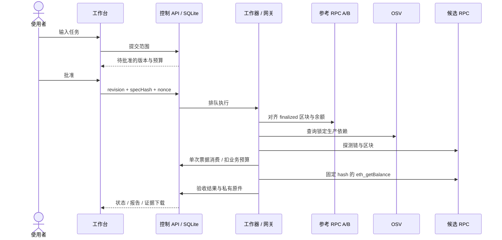

# 真实服务运行说明

实现日期：2026-10-08。运行入口为 `src/server.js`，默认开启 LIVE，监听本机 `127.0.0.1:8787`。

## 一次真实调用

1. 页面保持空白。用户输入一个 Ethereum 地址的原生 ETH 余额任务，点击提交。
2. 本地规则解析生成范围，保存候选 manifest 摘要、参考配置摘要与 package.json/pnpm-lock.yaml 摘要；此时零外部请求。
3. 用户批准后，工作器向两个参考来源分别查询 chainId 和 finalized header。按设计策略，高度差超过 32 个区块时隔离；否则选取较低者，双方重读该高度，核对 hash 和 timestamp，再使用 `eth_getBalance(address, {blockHash, requireCanonical:true})` 核对同区块余额。参考阶段正常为 8 次 RPC；不能仅因 finalized 时间戳早于当前几分钟就判错。
4. 静态遍历锁文件的根 production dependencies、传递 dependencies/optionalDependencies，对固定版本进行真实 OSV querybatch。命中公告时取完整记录并处理分页；未撤销公告阻断，接口不可用则隔离。只扫描本项目客户端依赖，**不是远程 Agent 的依赖扫描**。
5. 候选先查询 chainId 与固定区块 header。通过后单次网关票据扣除业务预算，再用 EIP-1898 调用余额。只有整数、地址/资产/链、请求绑定区块和参考金额规则全部通过才产生 acceptedFact。
6. 失败候选最多切换一次；两次业务调用为上限。公共报告与私有原件保留，下载按钮导出完整证据包。离线命令 `pnpm verify:bundle <文件>` 可在另一进程重算报告 Keccak/JCS 与原件 SHA-256。

## 配置

复制 `.env.example` 为 `.env`。空 RPC 值使用以下公开默认地址：

| 角色 | 默认服务 |
| --- | --- |
| 参考 A / 首选 | `https://ethereum-rpc.publicnode.com` |
| 参考 B / 备用 | `https://eth.drpc.org` |

可设置 `AA_REFERENCE_RPC_A/B`、`AA_PRIMARY_RPC`、`AA_BACKUP_RPC`。仅允许服务端配置的 HTTPS 443 域名，不接受浏览器/模型传入 URL。RPC Key 如嵌入路径或 query，只留在 `.env`；task、报告、观测元数据不存原始 endpoint，manifest 只存 endpointHash。不要把环境文件或任务数据库提交 Git。

可用 `AA_REFERENCE_OPERATOR_A/B`、`AA_PRIMARY_OPERATOR`、`AA_BACKUP_OPERATOR` 指定经核对的运营方标识（小写字母开头，字母/数字/下划线/冒号/短横线，共 3–128 字符）；默认由域名生成。不同域名及标签只是最低配置约束，不能证明运营方独立。默认两个参考与两个候选重叠，不能宣称四源验证。

`AA_ENABLE_LIVE=false` 关闭真实任务入口。`AA_EXECUTION_MODE` 是 API 未指定 executionMode 时的默认值；前端显式指定 LIVE/SAMPLE。配置或依赖变化后请新建任务；旧批准会被隔离。服务器重启读取新配置。

## 预算、失败与保存

- 每请求总时限 12 秒、每次响应最大 1 MiB、单运行总时限 180 秒。
- RPC 总上限 18；参考最多 12、候选 header/chain 探测最多 4、业务余额最多 2。当前正常路径是 8+2+1。OSV 独立上限 20 次请求。无自动重试，依赖检查只在本次运行的候选间复用。
- 两个同时运行名额；停止触发取消并保留已消费预算。成功先提交时保持成功；停止先提交时丢弃晚到事实。启动时隔离执行中任务，不重放不明调用。
- `RATE_LIMITED`、timeout、参考冲突、OSV 不可用属于证据不足，不能当成服务造假。业务金额不一致属于本次验收 FAIL；未附远程签名，不推出可归责的公开欺诈指控。
- 原件保存于 SQLite，文件默认 `.data/admission.sqlite`。公开报告只引用原件 ID，下载证据包需要同一会话 owner。仅正常 JSON-RPC 响应保存原始字节；上游 error message 不保存，防止凭据被回显，错误以固定代码记录。
- 依赖输入原文随新运行保存，可重算 digest。扫描不验证安装目录字节、Node 运行时、开发依赖或远端部署。`pnpm install --frozen-lockfile` 是运行前提。
- 服务器关闭后浏览器会话失效；历史数据仍在本机，不提供跨会话恢复界面。当前是单机服务，不具备公网账户、跨节点队列、长期保留策略或生产 SLA。

## 验证与能力边界

`pnpm test` 是不联网的边界/错误测试；`pnpm test:live` 是主动真实查询，使用公开零地址，结果写入 `artifacts/live/`。第三方故障导致非零退出码是有效观测，不能改为 SAMPLE 充数。浏览器真实测试：配置 Playwright 的模块位置及 Edge 路径后运行 `node scripts/ui-live-smoke.mjs`。

证据摘要说明字节一致，不证明数据真实、运营方身份或签名。原始 `eth_getBalance` 返回只有一个数值，因此标记 `REQUEST_BOUND`，不能当成服务签署了所用区块声明。没有实现 EIP-1186 状态证明、ERC-8004 信誉提交或 BOT 交易广播。

PI 接口文档尚未提供，保留 `POST /v1/model/drafts` 注入点。五个网站是待适配业务服务，不因首页能打开就成为可调用工具；各自需要正式 API、鉴权和相应的任务验收规则。

## 原始规范

- [Ethereum JSON-RPC](https://ethereum.org/en/developers/docs/apis/json-rpc/)：方法、chainId、finalized、QUANTITY。
- [EIP-1898](https://eips.ethereum.org/EIPS/eip-1898)：按 blockHash 查询与 requireCanonical。
- [OSV querybatch](https://google.github.io/osv.dev/post-v1-querybatch/)、[query](https://google.github.io/osv.dev/post-v1-query/)、[vulnerability](https://google.github.io/osv.dev/get-v1-vulns/)：批量查询、分页和公告记录。
- [RFC 8785](https://www.rfc-editor.org/rfc/rfc8785)：JSON 规范化。
- [Node.js HTTPS](https://nodejs.org/api/https.html)、[DNS](https://nodejs.org/api/dns.html)：TLS hostname 与受控 lookup。

这些资料用于实现约束；它们不替本项目提供第三方审计背书。
